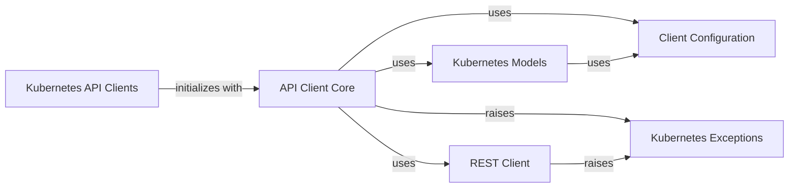

## Component Details

This graph illustrates the core components of the Kubernetes Python client's API interaction subsystem. The API Client Core acts as the central hub, managing HTTP requests, data serialization, and integrating with other components. It relies on the Client Configuration for connection details and the REST Client for actual HTTP communication. High-level Kubernetes API Clients utilize the API Client Core to interact with specific Kubernetes resources, which are represented by Kubernetes Models for data handling. Errors during these interactions are managed through Kubernetes Exceptions.

### API Client Core
The foundational component for interacting with the Kubernetes API. It manages HTTP requests, responses, and handles data serialization/deserialization. It integrates with the Client Configuration for authentication and connection details and utilizes the REST Client for actual HTTP communication. It also handles and raises Kubernetes Exceptions.

**Related Classes/Methods**:

- <a href="https://github.com/kubernetes-client/python/blob/master/kubernetes/client/api_client.py#L33-L647" target="_blank" rel="noopener noreferrer">`kubernetes.client.api_client.ApiClient` (33:647)</a>

### Client Configuration
Manages the configuration settings for the Kubernetes client, such as API host, authentication details (API keys, tokens), and client-side validation. It provides methods to retrieve and set default configurations and is used by the API Client Core and data models.

**Related Classes/Methods**:

- <a href="https://github.com/kubernetes-client/python/blob/master/kubernetes/client/configuration.py#L25-L405" target="_blank" rel="noopener noreferrer">`kubernetes.client.configuration.Configuration` (25:405)</a>

### REST Client
A low-level HTTP client that performs the actual HTTP requests (GET, POST, PUT, DELETE, etc.) to the Kubernetes API. It is utilized by the API Client Core to send requests and receive raw responses and can raise Kubernetes Exceptions.

**Related Classes/Methods**:

- <a href="https://github.com/kubernetes-client/python/blob/master/kubernetes/client/rest.py#L51-L305" target="_blank" rel="noopener noreferrer">`kubernetes.client.rest.RESTClientObject` (51:305)</a>

### Kubernetes API Clients
A collection of high-level API classes, each providing an interface for interacting with specific groups of Kubernetes resources (e.g., Core, Apps, RBAC, Networking, Batch, Storage, etc.). These classes abstract the underlying HTTP requests and data serialization, making it easier to manage Kubernetes objects. They initialize with and use the API Client Core.

**Related Classes/Methods**:

- <a href="https://github.com/kubernetes-client/python/blob/master/kubernetes/client/api/core_v1_api.py#L27-L30454" target="_blank" rel="noopener noreferrer">`kubernetes.client.api.core_v1_api.CoreV1Api` (27:30454)</a>
- <a href="https://github.com/kubernetes-client/python/blob/master/kubernetes/client/api/apps_v1_api.py#L27-L9529" target="_blank" rel="noopener noreferrer">`kubernetes.client.api.apps_v1_api.AppsV1Api` (27:9529)</a>
- <a href="https://github.com/kubernetes-client/python/blob/master/kubernetes/client/api/rbac_authorization_v1_api.py#L27-L4736" target="_blank" rel="noopener noreferrer">`kubernetes.client.api.rbac_authorization_v1_api.RbacAuthorizationV1Api` (27:4736)</a>
- <a href="https://github.com/kubernetes-client/python/blob/master/kubernetes/client/api/networking_v1_api.py#L27-L6628" target="_blank" rel="noopener noreferrer">`kubernetes.client.api.networking_v1_api.NetworkingV1Api` (27:6628)</a>
- <a href="https://github.com/kubernetes-client/python/blob/master/kubernetes/client/api/storage_v1_api.py#L27-L5964" target="_blank" rel="noopener noreferrer">`kubernetes.client.api.storage_v1_api.StorageV1Api` (27:5964)</a>

### Kubernetes Exceptions
A set of custom exception classes used to signal various errors that can occur during interactions with the Kubernetes API, such as invalid input, network issues, or API server errors. These exceptions are raised by the API Client Core and REST Client.

**Related Classes/Methods**:

- <a href="https://github.com/kubernetes-client/python/blob/master/kubernetes/client/exceptions.py#L84-L109" target="_blank" rel="noopener noreferrer">`kubernetes.client.exceptions.ApiException` (84:109)</a>
- <a href="https://github.com/kubernetes-client/python/blob/master/kubernetes/client/exceptions.py#L49-L64" target="_blank" rel="noopener noreferrer">`kubernetes.client.exceptions.ApiValueError` (49:64)</a>
- <a href="https://github.com/kubernetes-client/python/blob/master/kubernetes/client/exceptions.py#L20-L46" target="_blank" rel="noopener noreferrer">`kubernetes.client.exceptions.ApiTypeError` (20:46)</a>
- <a href="https://github.com/kubernetes-client/python/blob/master/kubernetes/client/exceptions.py#L67-L81" target="_blank" rel="noopener noreferrer">`kubernetes.client.exceptions.ApiKeyError` (67:81)</a>

### Kubernetes Models
A comprehensive set of Python classes that represent the various Kubernetes API objects (e.g., Pod, Deployment, Service, ConfigMap, etc.). These models are used for data serialization and deserialization when interacting with the Kubernetes API. They depend on the Client Configuration for their internal workings (e.g., type validation, default values).

**Related Classes/Methods**:

- <a href="https://github.com/kubernetes-client/python/blob/master/kubernetes/client/models/v1_pod.py#L21-L228" target="_blank" rel="noopener noreferrer">`kubernetes.client.models.v1_pod.V1Pod` (21:228)</a>
- <a href="https://github.com/kubernetes-client/python/blob/master/kubernetes/client/models/v1_deployment.py#L21-L228" target="_blank" rel="noopener noreferrer">`kubernetes.client.models.v1_deployment.V1Deployment` (21:228)</a>
- <a href="https://github.com/kubernetes-client/python/blob/master/kubernetes/client/models/v1_service.py#L21-L228" target="_blank" rel="noopener noreferrer">`kubernetes.client.models.v1_service.V1Service` (21:228)</a>
- <a href="https://github.com/kubernetes-client/python/blob/master/kubernetes/client/models/v1_config_map.py#L21-L260" target="_blank" rel="noopener noreferrer">`kubernetes.client.models.v1_config_map.V1ConfigMap` (21:260)</a>
- <a href="https://github.com/kubernetes-client/python/blob/master/kubernetes/client/models/v1_secret.py#L21-L288" target="_blank" rel="noopener noreferrer">`kubernetes.client.models.v1_secret.V1Secret` (21:288)</a>

### [FAQ](https://github.com/CodeBoarding/GeneratedOnBoardings/tree/main?tab=readme-ov-file#faq)