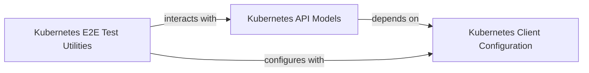

## Component Details

This graph illustrates the core components involved in representing and interacting with Kubernetes API objects. The central component, 'Kubernetes API Models', defines the data structures for various Kubernetes resources. These models rely on the 'Kubernetes Client Configuration' for their initialization and overall client settings. The 'Kubernetes E2E Test Utilities' component leverages both the API models to create and manage test resources and the client configuration to establish the testing environment, ensuring end-to-end functionality.

### Kubernetes API Models
This component encompasses all the Python classes that represent various Kubernetes API objects (e.g., Pods, Deployments, Services, Namespaces). These classes are primarily responsible for data serialization and deserialization to and from dictionary representations, and for initializing themselves using the client configuration. They provide the structured data models for interacting with the Kubernetes API.

**Related Classes/Methods**:

- <a href="https://github.com/kubernetes-client/python/blob/master/kubernetes/client/models/v1_pod.py#L21-L228" target="_blank" rel="noopener noreferrer">`kubernetes.client.models.v1_pod.V1Pod` (21:228)</a>
- <a href="https://github.com/kubernetes-client/python/blob/master/kubernetes/client/models/v1_service.py#L21-L228" target="_blank" rel="noopener noreferrer">`kubernetes.client.models.v1_service.V1Service` (21:228)</a>
- <a href="https://github.com/kubernetes-client/python/blob/master/kubernetes/client/models/v1_object_meta.py#L21-L514" target="_blank" rel="noopener noreferrer">`kubernetes.client.models.v1_object_meta.V1ObjectMeta` (21:514)</a>
- <a href="https://github.com/kubernetes-client/python/blob/master/kubernetes/client/models/v1_namespace.py#L21-L228" target="_blank" rel="noopener noreferrer">`kubernetes.client.models.v1_namespace.V1Namespace` (21:228)</a>
- <a href="https://github.com/kubernetes-client/python/blob/master/kubernetes/client/models/v1_deployment.py#L21-L228" target="_blank" rel="noopener noreferrer">`kubernetes.client.models.v1_deployment.V1Deployment` (21:228)</a>
- <a href="https://github.com/kubernetes-client/python/blob/master/kubernetes/client/models/v1_config_map.py#L21-L260" target="_blank" rel="noopener noreferrer">`kubernetes.client.models.v1_config_map.V1ConfigMap` (21:260)</a>
- <a href="https://github.com/kubernetes-client/python/blob/master/kubernetes/client/models/v1_secret.py#L21-L288" target="_blank" rel="noopener noreferrer">`kubernetes.client.models.v1_secret.V1Secret` (21:288)</a>
- <a href="https://github.com/kubernetes-client/python/blob/master/kubernetes/client/models/v1_pod_spec.py#L21-L1205" target="_blank" rel="noopener noreferrer">`kubernetes.client.models.v1_pod_spec.V1PodSpec` (21:1205)</a>
- <a href="https://github.com/kubernetes-client/python/blob/master/kubernetes/client/models/v1_pod_status.py#L21-L570" target="_blank" rel="noopener noreferrer">`kubernetes.client.models.v1_pod_status.V1PodStatus` (21:570)</a>

### Kubernetes Client Configuration
This component is responsible for managing the configuration settings for the Kubernetes client, such as API host, SSL verification, and API keys. It provides the necessary context for other client components to interact with the Kubernetes API server.

**Related Classes/Methods**:

- <a href="https://github.com/kubernetes-client/python/blob/master/kubernetes/client/configuration.py#L25-L405" target="_blank" rel="noopener noreferrer">`kubernetes.client.configuration.Configuration` (25:405)</a>

### Kubernetes E2E Test Utilities
This component provides utility functions and classes specifically designed for end-to-end testing of Kubernetes functionalities. It includes methods for setting up and tearing down test environments, often by creating and managing Kubernetes resources.

**Related Classes/Methods**:

- <a href="https://github.com/kubernetes-client/python/blob/master/kubernetes/e2e_test/test_utils.py#L27-L609" target="_blank" rel="noopener noreferrer">`kubernetes.e2e_test.test_utils.TestUtils` (27:609)</a>
- <a href="https://github.com/kubernetes-client/python/blob/master/kubernetes/utils/create_from_yaml.py#L99-L181" target="_blank" rel="noopener noreferrer">`kubernetes.utils.create_from_yaml` (99:181)</a>
- `kubernetes.utils.create_from_dict` (full file reference)

### [FAQ](https://github.com/CodeBoarding/GeneratedOnBoardings/tree/main?tab=readme-ov-file#faq)