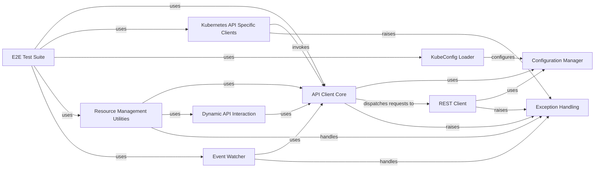

## Component Details

This graph illustrates the architecture of the Kubernetes Python client library, focusing on how different components interact to provide a comprehensive interface for managing Kubernetes resources. The core functionality revolves around the API Client Core, which orchestrates API calls, supported by the REST Client for low-level HTTP operations and the Configuration Manager for managing client settings. The KubeConfig Loader handles authentication, while Kubernetes API Specific Clients and Dynamic API Interaction provide structured and flexible ways to interact with the API. Resource Management Utilities offer high-level resource creation, and the Event Watcher enables real-time monitoring. Exception Handling ensures robust error reporting, and the E2E Test Suite validates the entire system.

### API Client Core
The central component responsible for orchestrating API calls to the Kubernetes cluster. It handles request serialization, response deserialization, manages default headers, and dispatches requests to the underlying REST client. It also supports asynchronous requests via a thread pool.

**Related Classes/Methods**:

- <a href="https://github.com/kubernetes-client/python/blob/master/kubernetes/client/api_client.py#L33-L647" target="_blank" rel="noopener noreferrer">`kubernetes.client.api_client.ApiClient` (33:647)</a>
- <a href="https://github.com/kubernetes-client/python/blob/master/kubernetes/client/api_client.py#L68-L82" target="_blank" rel="noopener noreferrer">`kubernetes.client.api_client.ApiClient.__init__` (68:82)</a>
- <a href="https://github.com/kubernetes-client/python/blob/master/kubernetes/client/api_client.py#L120-L200" target="_blank" rel="noopener noreferrer">`kubernetes.client.api_client.ApiClient.__call_api` (120:200)</a>
- <a href="https://github.com/kubernetes-client/python/blob/master/kubernetes/client/api_client.py#L202-L242" target="_blank" rel="noopener noreferrer">`kubernetes.client.api_client.ApiClient.sanitize_for_serialization` (202:242)</a>
- <a href="https://github.com/kubernetes-client/python/blob/master/kubernetes/client/api_client.py#L244-L264" target="_blank" rel="noopener noreferrer">`kubernetes.client.api_client.ApiClient.deserialize` (244:264)</a>
- <a href="https://github.com/kubernetes-client/python/blob/master/kubernetes/client/api_client.py#L305-L366" target="_blank" rel="noopener noreferrer">`kubernetes.client.api_client.ApiClient.call_api` (305:366)</a>
- <a href="https://github.com/kubernetes-client/python/blob/master/kubernetes/client/api_client.py#L368-L425" target="_blank" rel="noopener noreferrer">`kubernetes.client.api_client.ApiClient.request` (368:425)</a>
- <a href="https://github.com/kubernetes-client/python/blob/master/kubernetes/client/api_client.py#L513-L535" target="_blank" rel="noopener noreferrer">`kubernetes.client.api_client.ApiClient.update_params_for_auth` (513:535)</a>
- <a href="https://github.com/kubernetes-client/python/blob/master/kubernetes/client/api_client.py#L583-L597" target="_blank" rel="noopener noreferrer">`kubernetes.client.api_client.ApiClient.__deserialize_date` (583:597)</a>
- <a href="https://github.com/kubernetes-client/python/blob/master/kubernetes/client/api_client.py#L599-L618" target="_blank" rel="noopener noreferrer">`kubernetes.client.api_client.ApiClient.__deserialize_datetime` (599:618)</a>
- <a href="https://github.com/kubernetes-client/python/blob/master/kubernetes/client/api_client.py#L620-L647" target="_blank" rel="noopener noreferrer">`kubernetes.client.api_client.ApiClient.__deserialize_model` (620:647)</a>

### REST Client
This component is responsible for performing low-level HTTP requests to the Kubernetes API server. It manages connection pools, SSL verification, and proxy settings, acting as the direct interface with the network.

**Related Classes/Methods**:

- <a href="https://github.com/kubernetes-client/python/blob/master/kubernetes/client/rest.py#L51-L305" target="_blank" rel="noopener noreferrer">`kubernetes.client.rest.RESTClientObject` (51:305)</a>
- <a href="https://github.com/kubernetes-client/python/blob/master/kubernetes/client/rest.py#L113-L240" target="_blank" rel="noopener noreferrer">`kubernetes.client.rest.RESTClientObject.request` (113:240)</a>
- <a href="https://github.com/kubernetes-client/python/blob/master/kubernetes/client/rest.py#L242-L248" target="_blank" rel="noopener noreferrer">`kubernetes.client.rest.RESTClientObject.GET` (242:248)</a>
- <a href="https://github.com/kubernetes-client/python/blob/master/kubernetes/client/rest.py#L250-L256" target="_blank" rel="noopener noreferrer">`kubernetes.client.rest.RESTClientObject.HEAD` (250:256)</a>
- <a href="https://github.com/kubernetes-client/python/blob/master/kubernetes/client/rest.py#L258-L266" target="_blank" rel="noopener noreferrer">`kubernetes.client.rest.RESTClientObject.OPTIONS` (258:266)</a>
- <a href="https://github.com/kubernetes-client/python/blob/master/kubernetes/client/rest.py#L268-L275" target="_blank" rel="noopener noreferrer">`kubernetes.client.rest.RESTClientObject.DELETE` (268:275)</a>
- <a href="https://github.com/kubernetes-client/python/blob/master/kubernetes/client/rest.py#L277-L285" target="_blank" rel="noopener noreferrer">`kubernetes.client.rest.RESTClientObject.POST` (277:285)</a>
- <a href="https://github.com/kubernetes-client/python/blob/master/kubernetes/client/rest.py#L287-L295" target="_blank" rel="noopener noreferrer">`kubernetes.client.rest.RESTClientObject.PUT` (287:295)</a>
- <a href="https://github.com/kubernetes-client/python/blob/master/kubernetes/client/rest.py#L297-L305" target="_blank" rel="noopener noreferrer">`kubernetes.client.rest.RESTClientObject.PATCH` (297:305)</a>

### Configuration Manager
Manages all client-side configuration settings for interacting with the Kubernetes API, including API host, SSL certificates, API keys, and connection pool parameters. It provides methods to retrieve and set default configurations.

**Related Classes/Methods**:

- <a href="https://github.com/kubernetes-client/python/blob/master/kubernetes/client/configuration.py#L25-L405" target="_blank" rel="noopener noreferrer">`kubernetes.client.configuration.Configuration` (25:405)</a>
- <a href="https://github.com/kubernetes-client/python/blob/master/kubernetes/client/configuration.py#L204-L215" target="_blank" rel="noopener noreferrer">`kubernetes.client.configuration.Configuration.get_default_copy` (204:215)</a>
- <a href="https://github.com/kubernetes-client/python/blob/master/kubernetes/client/configuration.py#L333-L346" target="_blank" rel="noopener noreferrer">`kubernetes.client.configuration.Configuration.auth_settings` (333:346)</a>
- <a href="https://github.com/kubernetes-client/python/blob/master/kubernetes/client/configuration.py#L372-L405" target="_blank" rel="noopener noreferrer">`kubernetes.client.configuration.Configuration.get_host_from_settings` (372:405)</a>

### KubeConfig Loader
Parses and loads Kubernetes cluster and user authentication information from kubeconfig files. It supports various authentication mechanisms like auth-providers (GCP, Azure, OIDC), tokens, exec plugins, and username/password, and can persist configuration changes.

**Related Classes/Methods**:

- <a href="https://github.com/kubernetes-client/python/blob/master/kubernetes/base/config/kube_config.py#L186-L598" target="_blank" rel="noopener noreferrer">`kubernetes.base.config.kube_config.KubeConfigLoader` (186:598)</a>
- <a href="https://github.com/kubernetes-client/python/blob/master/kubernetes/base/config/kube_config.py#L422-L483" target="_blank" rel="noopener noreferrer">`kubernetes.base.config.kube_config.KubeConfigLoader:_refresh_oidc` (422:483)</a>
- <a href="https://github.com/kubernetes-client/python/blob/master/kubernetes/base/config/kube_config.py#L588-L591" target="_blank" rel="noopener noreferrer">`kubernetes.base.config.kube_config.KubeConfigLoader.load_and_set` (588:591)</a>
- <a href="https://github.com/kubernetes-client/python/blob/master/kubernetes/base/config/kube_config.py#L799-L829" target="_blank" rel="noopener noreferrer">`kubernetes.base.config.kube_config.load_kube_config` (799:829)</a>
- <a href="https://github.com/kubernetes-client/python/blob/master/kubernetes/base/config/kube_config.py#L832-L863" target="_blank" rel="noopener noreferrer">`kubernetes.base.config.kube_config.load_kube_config_from_dict` (832:863)</a>
- <a href="https://github.com/kubernetes-client/python/blob/master/kubernetes/base/config/kube_config.py#L866-L881" target="_blank" rel="noopener noreferrer">`kubernetes.base.config.kube_config.new_client_from_config` (866:881)</a>
- <a href="https://github.com/kubernetes-client/python/blob/master/kubernetes/base/config/kube_config.py#L884-L901" target="_blank" rel="noopener noreferrer">`kubernetes.base.config.kube_config.new_client_from_config_dict` (884:901)</a>

### Resource Management Utilities
Provides high-level utility functions for creating Kubernetes resources from declarative YAML files or Python dictionaries. It abstracts away the direct API calls and handles resource lists and server-side apply operations.

**Related Classes/Methods**:

- <a href="https://github.com/kubernetes-client/python/blob/master/kubernetes/utils/create_from_yaml.py#L27-L96" target="_blank" rel="noopener noreferrer">`kubernetes.utils.create_from_yaml.create_from_directory` (27:96)</a>
- <a href="https://github.com/kubernetes-client/python/blob/master/kubernetes/utils/create_from_yaml.py#L99-L181" target="_blank" rel="noopener noreferrer">`kubernetes.utils.create_from_yaml.create_from_yaml` (99:181)</a>
- <a href="https://github.com/kubernetes-client/python/blob/master/kubernetes/utils/create_from_yaml.py#L184-L250" target="_blank" rel="noopener noreferrer">`kubernetes.utils.create_from_yaml.create_from_dict` (184:250)</a>
- <a href="https://github.com/kubernetes-client/python/blob/master/kubernetes/utils/create_from_yaml.py#L253-L306" target="_blank" rel="noopener noreferrer">`kubernetes.utils.create_from_yaml.create_from_yaml_single_item` (253:306)</a>
- <a href="https://github.com/kubernetes-client/python/blob/master/kubernetes/utils/create_from_yaml.py#L309-L324" target="_blank" rel="noopener noreferrer">`kubernetes.utils.create_from_yaml.FailToCreateError` (309:324)</a>

### Event Watcher
Enables real-time monitoring of changes to Kubernetes resources by streaming events from the API. It handles event deserialization and can automatically resume watching from the last known resource version.

**Related Classes/Methods**:

- <a href="https://github.com/kubernetes-client/python/blob/master/kubernetes/base/watch/watch.py#L86-L223" target="_blank" rel="noopener noreferrer">`kubernetes.base.watch.watch.Watch` (86:223)</a>
- <a href="https://github.com/kubernetes-client/python/blob/master/kubernetes/base/watch/watch.py#L88-L92" target="_blank" rel="noopener noreferrer">`kubernetes.base.watch.watch.Watch.__init__` (88:92)</a>
- <a href="https://github.com/kubernetes-client/python/blob/master/kubernetes/base/watch/watch.py#L111-L134" target="_blank" rel="noopener noreferrer">`kubernetes.base.watch.watch.Watch.unmarshal_event` (111:134)</a>
- <a href="https://github.com/kubernetes-client/python/blob/master/kubernetes/base/watch/watch.py#L136-L223" target="_blank" rel="noopener noreferrer">`kubernetes.base.watch.watch.Watch.stream` (136:223)</a>
- <a href="https://github.com/kubernetes-client/python/blob/master/kubernetes/base/watch/watch.py#L54-L83" target="_blank" rel="noopener noreferrer">`kubernetes.base.watch.watch.iter_resp_lines` (54:83)</a>

### Dynamic API Interaction
Offers a flexible way to interact with Kubernetes resources without requiring pre-generated client models. It discovers API resources at runtime, allowing for more generic and adaptable client implementations.

**Related Classes/Methods**:

- `kubernetes.dynamic.client.DynamicClient` (full file reference)
- `kubernetes.dynamic.client.DynamicClient.get` (full file reference)
- `kubernetes.dynamic.client.DynamicClient.create` (full file reference)
- `kubernetes.dynamic.client.DynamicClient.delete` (full file reference)
- `kubernetes.dynamic.client.DynamicClient.replace` (full file reference)
- `kubernetes.dynamic.client.DynamicClient.patch` (full file reference)
- `kubernetes.dynamic.client.DynamicClient.server_side_apply` (full file reference)
- `kubernetes.dynamic.client.DynamicClient.watch` (full file reference)

### Kubernetes API Specific Clients
A collection of auto-generated API client classes, each providing specific methods for interacting with different Kubernetes API groups and versions (e.g., CoreV1Api for core resources, AppsV1Api for application deployments). These clients abstract the underlying HTTP calls.

**Related Classes/Methods**:

- <a href="https://github.com/kubernetes-client/python/blob/master/kubernetes/client/api/core_v1_api.py#L27-L30454" target="_blank" rel="noopener noreferrer">`kubernetes.client.api.core_v1_api.CoreV1Api` (27:30454)</a>
- <a href="https://github.com/kubernetes-client/python/blob/master/kubernetes/client/api/apps_v1_api.py#L27-L9529" target="_blank" rel="noopener noreferrer">`kubernetes.client.api.apps_v1_api.AppsV1Api` (27:9529)</a>
- <a href="https://github.com/kubernetes-client/python/blob/master/kubernetes/client/api/batch_v1_api.py#L27-L3544" target="_blank" rel="noopener noreferrer">`kubernetes.client.api.batch_v1_api.BatchV1Api` (27:3544)</a>
- <a href="https://github.com/kubernetes-client/python/blob/master/kubernetes/client/api/rbac_authorization_v1_api.py#L27-L4736" target="_blank" rel="noopener noreferrer">`kubernetes.client.api.rbac_authorization_v1_api.RbacAuthorizationV1Api` (27:4736)</a>
- <a href="https://github.com/kubernetes-client/python/blob/master/kubernetes/client/api/networking_v1_api.py#L27-L6628" target="_blank" rel="noopener noreferrer">`kubernetes.client.api.networking_v1_api.NetworkingV1Api` (27:6628)</a>
- <a href="https://github.com/kubernetes-client/python/blob/master/kubernetes/client/api/coordination_v1_api.py#L27-L1402" target="_blank" rel="noopener noreferrer">`kubernetes.client.api.coordination_v1_api.CoordinationV1Api` (27:1402)</a>
- <a href="https://github.com/kubernetes-client/python/blob/master/kubernetes/client/api/storage_v1beta1_api.py#L27-L1179" target="_blank" rel="noopener noreferrer">`kubernetes.client.api.storage_v1beta1_api.StorageV1beta1Api` (27:1179)</a>
- <a href="https://github.com/kubernetes-client/python/blob/master/kubernetes/client/api/resource_v1beta2_api.py#L27-L5177" target="_blank" rel="noopener noreferrer">`kubernetes.client.api.resource_v1beta2_api.ResourceV1beta2Api` (27:5177)</a>
- <a href="https://github.com/kubernetes-client/python/blob/master/kubernetes/client/api/node_v1_api.py#L27-L1179" target="_blank" rel="noopener noreferrer">`kubernetes.client.api.node_v1_api.NodeV1Api` (27:1179)</a>
- <a href="https://github.com/kubernetes-client/python/blob/master/kubernetes/client/api/certificates_v1_api.py#L27-L2007" target="_blank" rel="noopener noreferrer">`kubernetes.client.api.certificates_v1_api.CertificatesV1Api` (27:2007)</a>

### Exception Handling
A set of custom exception classes used throughout the Kubernetes client library to provide structured error reporting for various API operation failures, including invalid parameters, network issues, and server-side errors.

**Related Classes/Methods**:

- <a href="https://github.com/kubernetes-client/python/blob/master/kubernetes/client/exceptions.py#L84-L109" target="_blank" rel="noopener noreferrer">`kubernetes.client.exceptions.ApiException` (84:109)</a>
- <a href="https://github.com/kubernetes-client/python/blob/master/kubernetes/client/exceptions.py#L49-L64" target="_blank" rel="noopener noreferrer">`kubernetes.client.exceptions.ApiValueError` (49:64)</a>
- <a href="https://github.com/kubernetes-client/python/blob/master/kubernetes/client/exceptions.py#L20-L46" target="_blank" rel="noopener noreferrer">`kubernetes.client.exceptions.ApiTypeError` (20:46)</a>
- <a href="https://github.com/kubernetes-client/python/blob/master/kubernetes/client/exceptions.py#L67-L81" target="_blank" rel="noopener noreferrer">`kubernetes.client.exceptions.ApiKeyError` (67:81)</a>

### E2E Test Suite
Contains end-to-end tests that validate the functionality of the Kubernetes Python client library by interacting with a live Kubernetes cluster. These tests cover various API operations and utility functions.

**Related Classes/Methods**:

- <a href="https://github.com/kubernetes-client/python/blob/master/kubernetes/e2e_test/test_client.py#L67-L607" target="_blank" rel="noopener noreferrer">`kubernetes.e2e_test.test_client.TestClient` (67:607)</a>
- <a href="https://github.com/kubernetes-client/python/blob/master/kubernetes/e2e_test/test_utils.py#L27-L609" target="_blank" rel="noopener noreferrer">`kubernetes.e2e_test.test_utils.TestUtils` (27:609)</a>
- <a href="https://github.com/kubernetes-client/python/blob/master/kubernetes/e2e_test/test_watch.py#L44-L96" target="_blank" rel="noopener noreferrer">`kubernetes.e2e_test.test_watch.TestClient` (44:96)</a>
- <a href="https://github.com/kubernetes-client/python/blob/master/kubernetes/e2e_test/test_apps.py#L25-L112" target="_blank" rel="noopener noreferrer">`kubernetes.e2e_test.test_apps.TestClientApps` (25:112)</a>
- <a href="https://github.com/kubernetes-client/python/blob/master/kubernetes/e2e_test/base.py#L23-L46" target="_blank" rel="noopener noreferrer">`kubernetes.e2e_test.base.get_e2e_configuration` (23:46)</a>
- <a href="https://github.com/kubernetes-client/python/blob/master/kubernetes/e2e_test/test_batch.py#L23-L64" target="_blank" rel="noopener noreferrer">`kubernetes.e2e_test.test_batch.TestClientBatch` (23:64)</a>

### [FAQ](https://github.com/CodeBoarding/GeneratedOnBoardings/tree/main?tab=readme-ov-file#faq)