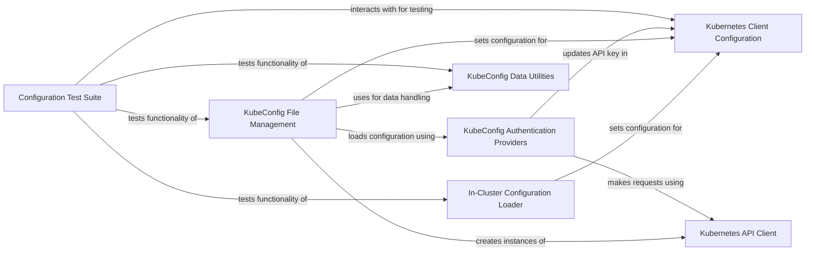

## Component Details

This graph illustrates the structure and interactions within the `ConfigManager` subsystem, which is responsible for loading, parsing, and managing Kubernetes client configurations. It details how in-cluster configurations and kubeconfig files are processed, how authentication mechanisms are handled, and how these configurations are used to set up the Kubernetes client and API client for interacting with the Kubernetes cluster.

### In-Cluster Configuration Loader
This component is responsible for loading Kubernetes configuration when the application is running inside a Kubernetes pod. It reads environment variables for service host and port, and files for service account token and CA certificate to configure the Kubernetes client.

**Related Classes/Methods**:

- <a href="https://github.com/kubernetes-client/python/blob/master/kubernetes/base/config/incluster_config.py#L37-L109" target="_blank" rel="noopener noreferrer">`kubernetes.base.config.incluster_config.InClusterConfigLoader` (37:109)</a>
- <a href="https://github.com/kubernetes-client/python/blob/master/kubernetes/base/config/incluster_config.py#L112-L121" target="_blank" rel="noopener noreferrer">`kubernetes.base.config.incluster_config.load_incluster_config` (112:121)</a>
- <a href="https://github.com/kubernetes-client/python/blob/master/kubernetes/base/config/incluster_config.py#L28-L34" target="_blank" rel="noopener noreferrer">`kubernetes.base.config.incluster_config._join_host_port` (28:34)</a>

### KubeConfig File Management
This component handles the parsing, loading, and merging of Kubernetes configuration from kubeconfig files. It provides functionalities to load configuration from a single file, multiple files, or a dictionary, and to manage contexts and user authentication details. It also supports persisting changes back to the kubeconfig file.

**Related Classes/Methods**:

- <a href="https://github.com/kubernetes-client/python/blob/master/kubernetes/base/config/kube_config.py#L186-L598" target="_blank" rel="noopener noreferrer">`kubernetes.base.config.kube_config.KubeConfigLoader` (186:598)</a>
- <a href="https://github.com/kubernetes-client/python/blob/master/kubernetes/base/config/kube_config.py#L667-L754" target="_blank" rel="noopener noreferrer">`kubernetes.base.config.kube_config.KubeConfigMerger` (667:754)</a>
- <a href="https://github.com/kubernetes-client/python/blob/master/kubernetes/base/config/kube_config.py#L799-L829" target="_blank" rel="noopener noreferrer">`kubernetes.base.config.kube_config.load_kube_config` (799:829)</a>
- <a href="https://github.com/kubernetes-client/python/blob/master/kubernetes/base/config/kube_config.py#L832-L863" target="_blank" rel="noopener noreferrer">`kubernetes.base.config.kube_config.load_kube_config_from_dict` (832:863)</a>
- <a href="https://github.com/kubernetes-client/python/blob/master/kubernetes/base/config/kube_config.py#L790-L796" target="_blank" rel="noopener noreferrer">`kubernetes.base.config.kube_config.list_kube_config_contexts` (790:796)</a>
- <a href="https://github.com/kubernetes-client/python/blob/master/kubernetes/base/config/kube_config.py#L866-L881" target="_blank" rel="noopener noreferrer">`kubernetes.base.config.kube_config.new_client_from_config` (866:881)</a>
- <a href="https://github.com/kubernetes-client/python/blob/master/kubernetes/base/config/kube_config.py#L884-L901" target="_blank" rel="noopener noreferrer">`kubernetes.base.config.kube_config.new_client_from_config_dict` (884:901)</a>
- <a href="https://github.com/kubernetes-client/python/blob/master/kubernetes/base/config/kube_config.py#L765-L787" target="_blank" rel="noopener noreferrer">`kubernetes.base.config.kube_config._get_kube_config_loader` (765:787)</a>
- <a href="https://github.com/kubernetes-client/python/blob/master/kubernetes/base/config/kube_config.py#L757-L762" target="_blank" rel="noopener noreferrer">`kubernetes.base.config.kube_config._get_kube_config_loader_for_yaml_file` (757:762)</a>

### KubeConfig Authentication Providers
This component manages various authentication mechanisms supported by kubeconfig, including token-based authentication, username/password, and external authentication providers like GCP, Azure, and OIDC. It handles token refreshing and credential management for these providers.

**Related Classes/Methods**:

- <a href="https://github.com/kubernetes-client/python/blob/master/kubernetes/base/config/kube_config.py#L274-L294" target="_blank" rel="noopener noreferrer">`kubernetes.base.config.kube_config.KubeConfigLoader._load_authentication` (274:294)</a>
- <a href="https://github.com/kubernetes-client/python/blob/master/kubernetes/base/config/kube_config.py#L296-L307" target="_blank" rel="noopener noreferrer">`kubernetes.base.config.kube_config.KubeConfigLoader._load_auth_provider_token` (296:307)</a>
- <a href="https://github.com/kubernetes-client/python/blob/master/kubernetes/base/config/kube_config.py#L317-L326" target="_blank" rel="noopener noreferrer">`kubernetes.base.config.kube_config.KubeConfigLoader._load_azure_token` (317:326)</a>
- <a href="https://github.com/kubernetes-client/python/blob/master/kubernetes/base/config/kube_config.py#L328-L352" target="_blank" rel="noopener noreferrer">`kubernetes.base.config.kube_config.KubeConfigLoader._refresh_azure_token` (328:352)</a>
- <a href="https://github.com/kubernetes-client/python/blob/master/kubernetes/base/config/kube_config.py#L354-L365" target="_blank" rel="noopener noreferrer">`kubernetes.base.config.kube_config.KubeConfigLoader._load_gcp_token` (354:365)</a>
- <a href="https://github.com/kubernetes-client/python/blob/master/kubernetes/base/config/kube_config.py#L367-L375" target="_blank" rel="noopener noreferrer">`kubernetes.base.config.kube_config.KubeConfigLoader._refresh_gcp_token` (367:375)</a>
- <a href="https://github.com/kubernetes-client/python/blob/master/kubernetes/base/config/kube_config.py#L377-L420" target="_blank" rel="noopener noreferrer">`kubernetes.base.config.kube_config.KubeConfigLoader._load_oid_token` (377:420)</a>
- <a href="https://github.com/kubernetes-client/python/blob/master/kubernetes/base/config/kube_config.py#L422-L483" target="_blank" rel="noopener noreferrer">`kubernetes.base.config.kube_config.KubeConfigLoader._refresh_oidc` (422:483)</a>
- <a href="https://github.com/kubernetes-client/python/blob/master/kubernetes/base/config/kube_config.py#L485-L520" target="_blank" rel="noopener noreferrer">`kubernetes.base.config.kube_config.KubeConfigLoader._load_from_exec_plugin` (485:520)</a>
- <a href="https://github.com/kubernetes-client/python/blob/master/kubernetes/base/config/kube_config.py#L522-L531" target="_blank" rel="noopener noreferrer">`kubernetes.base.config.kube_config.KubeConfigLoader._load_user_token` (522:531)</a>
- <a href="https://github.com/kubernetes-client/python/blob/master/kubernetes/base/config/kube_config.py#L533-L538" target="_blank" rel="noopener noreferrer">`kubernetes.base.config.kube_config.KubeConfigLoader._load_user_pass_token` (533:538)</a>
- <a href="https://github.com/kubernetes-client/python/blob/master/kubernetes/base/config/kube_config.py#L146-L183" target="_blank" rel="noopener noreferrer">`kubernetes.base.config.kube_config.CommandTokenSource` (146:183)</a>
- <a href="https://github.com/kubernetes-client/python/blob/master/kubernetes/base/config/exec_provider.py#L22-L116" target="_blank" rel="noopener noreferrer">`kubernetes.base.config.exec_provider.ExecProvider` (22:116)</a>

### KubeConfig Data Utilities
This component provides utility classes and functions for handling data within the kubeconfig context, such as abstracting file or data content, managing temporary files, and parsing/formatting dates.

**Related Classes/Methods**:

- <a href="https://github.com/kubernetes-client/python/blob/master/kubernetes/base/config/kube_config.py#L86-L143" target="_blank" rel="noopener noreferrer">`kubernetes.base.config.kube_config.FileOrData` (86:143)</a>
- <a href="https://github.com/kubernetes-client/python/blob/master/kubernetes/base/config/kube_config.py#L601-L664" target="_blank" rel="noopener noreferrer">`kubernetes.base.config.kube_config.ConfigNode` (601:664)</a>
- <a href="https://github.com/kubernetes-client/python/blob/master/kubernetes/base/config/kube_config.py#L63-L78" target="_blank" rel="noopener noreferrer">`kubernetes.base.config.kube_config._create_temp_file_with_content` (63:78)</a>
- <a href="https://github.com/kubernetes-client/python/blob/master/kubernetes/base/config/kube_config.py#L81-L83" target="_blank" rel="noopener noreferrer">`kubernetes.base.config.kube_config._is_expired` (81:83)</a>
- <a href="https://github.com/kubernetes-client/python/blob/master/kubernetes/base/config/kube_config.py#L53-L60" target="_blank" rel="noopener noreferrer">`kubernetes.base.config.kube_config._cleanup_temp_files` (53:60)</a>
- <a href="https://github.com/kubernetes-client/python/blob/master/kubernetes/base/config/dateutil.py#L50-L77" target="_blank" rel="noopener noreferrer">`kubernetes.base.config.dateutil.parse_rfc3339` (50:77)</a>
- <a href="https://github.com/kubernetes-client/python/blob/master/kubernetes/base/config/dateutil.py#L80-L84" target="_blank" rel="noopener noreferrer">`kubernetes.base.config.dateutil.format_rfc3339` (80:84)</a>
- `kubernetes.base.config.dateutil.UTC` (full file reference)
- <a href="https://github.com/kubernetes-client/python/blob/master/kubernetes/base/config/dateutil.py#L20-L34" target="_blank" rel="noopener noreferrer">`kubernetes.base.config.dateutil.TimezoneInfo` (20:34)</a>

### Configuration Test Suite
This component encompasses the test classes and helper methods used to validate the functionality of both in-cluster and kubeconfig file-based configuration loading and management.

**Related Classes/Methods**:

- <a href="https://github.com/kubernetes-client/python/blob/master/kubernetes/base/config/incluster_config_test.py#L46-L159" target="_blank" rel="noopener noreferrer">`kubernetes.base.config.incluster_config_test.InClusterConfigTest` (46:159)</a>
- `kubernetes.base.config.incluster_config_test._create_file_with_temp_content` (full file reference)
- `kubernetes.base.config.incluster_config_test._should_fail_load` (full file reference)
- <a href="https://github.com/kubernetes-client/python/blob/master/kubernetes/base/config/kube_config_test.py#L165-L268" target="_blank" rel="noopener noreferrer">`kubernetes.base.config.kube_config_test.TestFileOrData` (165:268)</a>
- <a href="https://github.com/kubernetes-client/python/blob/master/kubernetes/base/config/kube_config_test.py#L271-L344" target="_blank" rel="noopener noreferrer">`kubernetes.base.config.kube_config_test.TestConfigNode` (271:344)</a>
- <a href="https://github.com/kubernetes-client/python/blob/master/kubernetes/base/config/kube_config_test.py#L402-L1625" target="_blank" rel="noopener noreferrer">`kubernetes.base.config.kube_config_test.TestKubeConfigLoader` (402:1625)</a>
- <a href="https://github.com/kubernetes-client/python/blob/master/kubernetes/base/config/kube_config_test.py#L1655-L1911" target="_blank" rel="noopener noreferrer">`kubernetes.base.config.kube_config_test.TestKubeConfigMerger` (1655:1911)</a>
- <a href="https://github.com/kubernetes-client/python/blob/master/kubernetes/base/config/kube_config_test.py#L143-L162" target="_blank" rel="noopener noreferrer">`kubernetes.base.config.kube_config_test.BaseTestCase` (143:162)</a>
- <a href="https://github.com/kubernetes-client/python/blob/master/kubernetes/base/config/kube_config_test.py#L347-L399" target="_blank" rel="noopener noreferrer">`kubernetes.base.config.kube_config_test.FakeConfig` (347:399)</a>
- <a href="https://github.com/kubernetes-client/python/blob/master/kubernetes/base/config/kube_config_test.py#L73-L74" target="_blank" rel="noopener noreferrer">`kubernetes.base.config.kube_config_test._raise_exception` (73:74)</a>
- <a href="https://github.com/kubernetes-client/python/blob/master/kubernetes/base/config/kube_config_test.py#L66-L70" target="_blank" rel="noopener noreferrer">`kubernetes.base.config.kube_config_test._get_expiry` (66:70)</a>

### Kubernetes Client Configuration
This component represents the core configuration object for the Kubernetes client, holding details like host, SSL certificates, API keys, and connection settings. It is manipulated by the configuration loading components.

**Related Classes/Methods**:

- <a href="https://github.com/kubernetes-client/python/blob/master/kubernetes/client/configuration.py#L25-L405" target="_blank" rel="noopener noreferrer">`kubernetes.client.configuration.Configuration` (25:405)</a>

### Kubernetes API Client
This component represents the client used to interact with the Kubernetes API server. It uses the configuration provided by the `ConfigManager` to make API calls.

**Related Classes/Methods**:

- <a href="https://github.com/kubernetes-client/python/blob/master/kubernetes/client/api_client.py#L33-L647" target="_blank" rel="noopener noreferrer">`kubernetes.client.api_client.ApiClient` (33:647)</a>

### [FAQ](https://github.com/CodeBoarding/GeneratedOnBoardings/tree/main?tab=readme-ov-file#faq)