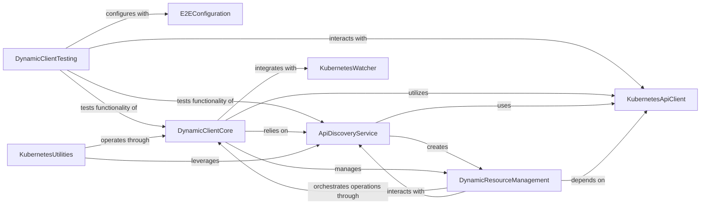

## Component Details

The DynamicClient subsystem provides a flexible and generic interface for interacting with Kubernetes resources. It dynamically discovers API groups and resources at runtime, enabling interaction with custom resources and new API versions without requiring code regeneration. This subsystem integrates core API client functionalities, API discovery mechanisms, and dynamic resource management to offer a robust and adaptable way to manage Kubernetes objects.

### DynamicClientTesting
This component encompasses the test classes for the dynamic client and discovery mechanisms, ensuring their correct functionality and interaction with the Kubernetes API.

**Related Classes/Methods**:

- <a href="https://github.com/kubernetes-client/python/blob/master/kubernetes/base/dynamic/test_client.py#L32-L537" target="_blank" rel="noopener noreferrer">`kubernetes.base.dynamic.test_client.TestDynamicClient` (32:537)</a>
- <a href="https://github.com/kubernetes-client/python/blob/master/kubernetes/base/dynamic/test_client.py#L540-L571" target="_blank" rel="noopener noreferrer">`kubernetes.base.dynamic.test_client.TestDynamicClientSerialization` (540:571)</a>
- <a href="https://github.com/kubernetes-client/python/blob/master/kubernetes/base/dynamic/test_discovery.py#L24-L61" target="_blank" rel="noopener noreferrer">`kubernetes.base.dynamic.test_discovery.TestDiscoverer` (24:61)</a>
- <a href="https://github.com/kubernetes-client/python/blob/master/kubernetes/base/dynamic/test_client.py#L27-L29" target="_blank" rel="noopener noreferrer">`kubernetes.base.dynamic.test_client.short_uuid` (27:29)</a>

### KubernetesApiClient
This component represents the core API client responsible for making HTTP requests to the Kubernetes API server. It's a fundamental building block for interacting with Kubernetes resources.

**Related Classes/Methods**:

- <a href="https://github.com/kubernetes-client/python/blob/master/kubernetes/client/api_client.py#L33-L647" target="_blank" rel="noopener noreferrer">`kubernetes.client.api_client.ApiClient` (33:647)</a>

### E2EConfiguration
This component handles the retrieval of end-to-end test configurations, providing necessary parameters for connecting to and interacting with a Kubernetes cluster during testing.

**Related Classes/Methods**:

- <a href="https://github.com/kubernetes-client/python/blob/master/kubernetes/e2e_test/base.py#L23-L46" target="_blank" rel="noopener noreferrer">`kubernetes.e2e_test.base.get_e2e_configuration` (23:46)</a>

### ApiDiscoveryService
This component is responsible for discovering and caching Kubernetes API groups and resources. It provides mechanisms to efficiently retrieve information about available API versions and their corresponding resources, supporting both eager and lazy discovery strategies.

**Related Classes/Methods**:

- <a href="https://github.com/kubernetes-client/python/blob/master/kubernetes/base/dynamic/discovery.py#L35-L217" target="_blank" rel="noopener noreferrer">`kubernetes.base.dynamic.discovery.Discoverer` (35:217)</a>
- <a href="https://github.com/kubernetes-client/python/blob/master/kubernetes/base/dynamic/discovery.py#L398-L409" target="_blank" rel="noopener noreferrer">`kubernetes.base.dynamic.discovery.ResourceGroup` (398:409)</a>
- <a href="https://github.com/kubernetes-client/python/blob/master/kubernetes/base/dynamic/discovery.py#L220-L316" target="_blank" rel="noopener noreferrer">`kubernetes.base.dynamic.discovery.LazyDiscoverer` (220:316)</a>
- <a href="https://github.com/kubernetes-client/python/blob/master/kubernetes/base/dynamic/discovery.py#L319-L395" target="_blank" rel="noopener noreferrer">`kubernetes.base.dynamic.discovery.EagerDiscoverer` (319:395)</a>
- <a href="https://github.com/kubernetes-client/python/blob/master/kubernetes/base/dynamic/discovery.py#L418-L433" target="_blank" rel="noopener noreferrer">`kubernetes.base.dynamic.discovery.CacheDecoder` (418:433)</a>
- <a href="https://github.com/kubernetes-client/python/blob/master/kubernetes/base/dynamic/discovery.py#L56-L73" target="_blank" rel="noopener noreferrer">`kubernetes.base.dynamic.discovery.Discoverer.__init_cache` (56:73)</a>
- <a href="https://github.com/kubernetes-client/python/blob/master/kubernetes/base/dynamic/discovery.py#L83-L84" target="_blank" rel="noopener noreferrer">`kubernetes.base.dynamic.discovery.Discoverer.invalidate_cache` (83:84)</a>
- <a href="https://github.com/kubernetes-client/python/blob/master/kubernetes/base/dynamic/discovery.py#L138-L156" target="_blank" rel="noopener noreferrer">`kubernetes.base.dynamic.discovery.Discoverer._load_server_info` (138:156)</a>
- <a href="https://github.com/kubernetes-client/python/blob/master/kubernetes/base/dynamic/discovery.py#L95-L96" target="_blank" rel="noopener noreferrer">`kubernetes.base.dynamic.discovery.Discoverer.discover` (95:96)</a>
- <a href="https://github.com/kubernetes-client/python/blob/master/kubernetes/base/dynamic/discovery.py#L75-L81" target="_blank" rel="noopener noreferrer">`kubernetes.base.dynamic.discovery.Discoverer._write_cache` (75:81)</a>
- <a href="https://github.com/kubernetes-client/python/blob/master/kubernetes/base/dynamic/discovery.py#L102-L112" target="_blank" rel="noopener noreferrer">`kubernetes.base.dynamic.discovery.Discoverer.default_groups` (102:112)</a>
- <a href="https://github.com/kubernetes-client/python/blob/master/kubernetes/base/dynamic/discovery.py#L158-L196" target="_blank" rel="noopener noreferrer">`kubernetes.base.dynamic.discovery.Discoverer.get_resources_for_api_version` (158:196)</a>
- <a href="https://github.com/kubernetes-client/python/blob/master/kubernetes/base/dynamic/discovery.py#L114-L136" target="_blank" rel="noopener noreferrer">`kubernetes.base.dynamic.discovery.Discoverer.parse_api_groups` (114:136)</a>
- <a href="https://github.com/kubernetes-client/python/blob/master/kubernetes/base/dynamic/discovery.py#L91-L92" target="_blank" rel="noopener noreferrer">`kubernetes.base.dynamic.discovery.Discoverer.search` (91:92)</a>
- <a href="https://github.com/kubernetes-client/python/blob/master/kubernetes/base/dynamic/discovery.py#L234-L237" target="_blank" rel="noopener noreferrer">`kubernetes.base.dynamic.discovery.LazyDiscoverer.__maybe_write_cache` (234:237)</a>
- <a href="https://github.com/kubernetes-client/python/blob/master/kubernetes/base/dynamic/discovery.py#L240-L241" target="_blank" rel="noopener noreferrer">`kubernetes.base.dynamic.discovery.LazyDiscoverer.api_groups` (240:241)</a>
- <a href="https://github.com/kubernetes-client/python/blob/master/kubernetes/base/dynamic/discovery.py#L255-L295" target="_blank" rel="noopener noreferrer">`kubernetes.base.dynamic.discovery.LazyDiscoverer.__search` (255:295)</a>
- <a href="https://github.com/kubernetes-client/python/blob/master/kubernetes/base/dynamic/discovery.py#L297-L302" target="_blank" rel="noopener noreferrer">`kubernetes.base.dynamic.discovery.LazyDiscoverer.__build_search` (297:302)</a>
- <a href="https://github.com/kubernetes-client/python/blob/master/kubernetes/base/dynamic/discovery.py#L304-L316" target="_blank" rel="noopener noreferrer">`kubernetes.base.dynamic.discovery.LazyDiscoverer.__iter__` (304:316)</a>
- <a href="https://github.com/kubernetes-client/python/blob/master/kubernetes/base/dynamic/discovery.py#L365-L388" target="_blank" rel="noopener noreferrer">`kubernetes.base.dynamic.discovery.EagerDiscoverer.__search` (365:388)</a>
- <a href="https://github.com/kubernetes-client/python/blob/master/kubernetes/base/dynamic/discovery.py#L358-L363" target="_blank" rel="noopener noreferrer">`kubernetes.base.dynamic.discovery.EagerDiscoverer.__build_search` (358:363)</a>
- <a href="https://github.com/kubernetes-client/python/blob/master/kubernetes/base/dynamic/discovery.py#L423-L433" target="_blank" rel="noopener noreferrer">`kubernetes.base.dynamic.discovery.CacheDecoder.object_hook` (423:433)</a>

### DynamicResourceManagement
This component provides an abstraction layer for interacting with Kubernetes resources dynamically. It defines classes for representing resources, lists of resources, and individual resource instances, along with methods for common operations like creation, retrieval, update, and deletion.

**Related Classes/Methods**:

- <a href="https://github.com/kubernetes-client/python/blob/master/kubernetes/base/dynamic/resource.py#L22-L105" target="_blank" rel="noopener noreferrer">`kubernetes.base.dynamic.resource.Resource` (22:105)</a>
- <a href="https://github.com/kubernetes-client/python/blob/master/kubernetes/base/dynamic/resource.py#L232-L278" target="_blank" rel="noopener noreferrer">`kubernetes.base.dynamic.resource.Subresource` (232:278)</a>
- <a href="https://github.com/kubernetes-client/python/blob/master/kubernetes/base/dynamic/resource.py#L108-L229" target="_blank" rel="noopener noreferrer">`kubernetes.base.dynamic.resource.ResourceList` (108:229)</a>
- <a href="https://github.com/kubernetes-client/python/blob/master/kubernetes/base/dynamic/resource.py#L281-L359" target="_blank" rel="noopener noreferrer">`kubernetes.base.dynamic.resource.ResourceInstance` (281:359)</a>
- <a href="https://github.com/kubernetes-client/python/blob/master/kubernetes/base/dynamic/resource.py#L362-L405" target="_blank" rel="noopener noreferrer">`kubernetes.base.dynamic.resource.ResourceField` (362:405)</a>
- <a href="https://github.com/kubernetes-client/python/blob/master/kubernetes/base/dynamic/resource.py#L131-L159" target="_blank" rel="noopener noreferrer">`kubernetes.base.dynamic.resource.ResourceList._items_to_resources` (131:159)</a>
- <a href="https://github.com/kubernetes-client/python/blob/master/kubernetes/base/dynamic/resource.py#L161-L173" target="_blank" rel="noopener noreferrer">`kubernetes.base.dynamic.resource.ResourceList._item_to_resource` (161:173)</a>
- <a href="https://github.com/kubernetes-client/python/blob/master/kubernetes/base/dynamic/resource.py#L120-L129" target="_blank" rel="noopener noreferrer">`kubernetes.base.dynamic.resource.ResourceList.base_resource` (120:129)</a>
- <a href="https://github.com/kubernetes-client/python/blob/master/kubernetes/base/dynamic/resource.py#L175-L185" target="_blank" rel="noopener noreferrer">`kubernetes.base.dynamic.resource.ResourceList.get` (175:185)</a>
- <a href="https://github.com/kubernetes-client/python/blob/master/kubernetes/base/dynamic/resource.py#L187-L197" target="_blank" rel="noopener noreferrer">`kubernetes.base.dynamic.resource.ResourceList.delete` (187:197)</a>
- <a href="https://github.com/kubernetes-client/python/blob/master/kubernetes/base/dynamic/resource.py#L199-L206" target="_blank" rel="noopener noreferrer">`kubernetes.base.dynamic.resource.ResourceList.verb_mapper` (199:206)</a>
- <a href="https://github.com/kubernetes-client/python/blob/master/kubernetes/base/dynamic/resource.py#L208-L209" target="_blank" rel="noopener noreferrer">`kubernetes.base.dynamic.resource.ResourceList.create` (208:209)</a>
- <a href="https://github.com/kubernetes-client/python/blob/master/kubernetes/base/dynamic/resource.py#L211-L212" target="_blank" rel="noopener noreferrer">`kubernetes.base.dynamic.resource.ResourceList.replace` (211:212)</a>
- <a href="https://github.com/kubernetes-client/python/blob/master/kubernetes/base/dynamic/resource.py#L214-L215" target="_blank" rel="noopener noreferrer">`kubernetes.base.dynamic.resource.ResourceList.patch` (214:215)</a>
- <a href="https://github.com/kubernetes-client/python/blob/master/kubernetes/base/dynamic/resource.py#L226-L229" target="_blank" rel="noopener noreferrer">`kubernetes.base.dynamic.resource.ResourceList.__getattr__` (226:229)</a>
- <a href="https://github.com/kubernetes-client/python/blob/master/kubernetes/base/dynamic/resource.py#L250-L256" target="_blank" rel="noopener noreferrer">`kubernetes.base.dynamic.resource.Subresource.create` (250:256)</a>
- <a href="https://github.com/kubernetes-client/python/blob/master/kubernetes/base/dynamic/resource.py#L89-L100" target="_blank" rel="noopener noreferrer">`kubernetes.base.dynamic.resource.Resource.path` (89:100)</a>
- <a href="https://github.com/kubernetes-client/python/blob/master/kubernetes/base/dynamic/resource.py#L305-L313" target="_blank" rel="noopener noreferrer">`kubernetes.base.dynamic.resource.ResourceInstance.__deserialize` (305:313)</a>
- <a href="https://github.com/kubernetes-client/python/blob/master/kubernetes/base/dynamic/resource.py#L315-L325" target="_blank" rel="noopener noreferrer">`kubernetes.base.dynamic.resource.ResourceInstance.__serialize` (315:325)</a>
- <a href="https://github.com/kubernetes-client/python/blob/master/kubernetes/base/dynamic/resource.py#L327-L328" target="_blank" rel="noopener noreferrer">`kubernetes.base.dynamic.resource.ResourceInstance.to_dict` (327:328)</a>
- <a href="https://github.com/kubernetes-client/python/blob/master/kubernetes/base/dynamic/resource.py#L333-L337" target="_blank" rel="noopener noreferrer">`kubernetes.base.dynamic.resource.ResourceInstance.__repr__` (333:337)</a>
- <a href="https://github.com/kubernetes-client/python/blob/master/kubernetes/base/dynamic/resource.py#L395-L396" target="_blank" rel="noopener noreferrer">`kubernetes.base.dynamic.resource.ResourceField.to_dict` (395:396)</a>
- <a href="https://github.com/kubernetes-client/python/blob/master/kubernetes/base/dynamic/resource.py#L398-L405" target="_blank" rel="noopener noreferrer">`kubernetes.base.dynamic.resource.ResourceField.__serialize` (398:405)</a>

### DynamicClientCore
This component provides the main interface for interacting with Kubernetes resources dynamically. It leverages the API Discovery Service to understand resource schemas and the Kubernetes API Client to perform operations like get, create, delete, replace, patch, and server-side apply.

**Related Classes/Methods**:

- <a href="https://github.com/kubernetes-client/python/blob/master/kubernetes/base/dynamic/client.py#L72-L327" target="_blank" rel="noopener noreferrer">`kubernetes.base.dynamic.client.DynamicClient` (72:327)</a>
- <a href="https://github.com/kubernetes-client/python/blob/master/kubernetes/base/dynamic/client.py#L110-L112" target="_blank" rel="noopener noreferrer">`kubernetes.base.dynamic.client.DynamicClient.get` (110:112)</a>
- <a href="https://github.com/kubernetes-client/python/blob/master/kubernetes/base/dynamic/client.py#L114-L119" target="_blank" rel="noopener noreferrer">`kubernetes.base.dynamic.client.DynamicClient.create` (114:119)</a>
- <a href="https://github.com/kubernetes-client/python/blob/master/kubernetes/base/dynamic/client.py#L121-L127" target="_blank" rel="noopener noreferrer">`kubernetes.base.dynamic.client.DynamicClient.delete` (121:127)</a>
- <a href="https://github.com/kubernetes-client/python/blob/master/kubernetes/base/dynamic/client.py#L129-L137" target="_blank" rel="noopener noreferrer">`kubernetes.base.dynamic.client.DynamicClient.replace` (129:137)</a>
- <a href="https://github.com/kubernetes-client/python/blob/master/kubernetes/base/dynamic/client.py#L139-L150" target="_blank" rel="noopener noreferrer">`kubernetes.base.dynamic.client.DynamicClient.patch` (139:150)</a>
- <a href="https://github.com/kubernetes-client/python/blob/master/kubernetes/base/dynamic/client.py#L152-L164" target="_blank" rel="noopener noreferrer">`kubernetes.base.dynamic.client.DynamicClient.server_side_apply` (152:164)</a>
- <a href="https://github.com/kubernetes-client/python/blob/master/kubernetes/base/dynamic/client.py#L166-L214" target="_blank" rel="noopener noreferrer">`kubernetes.base.dynamic.client.DynamicClient.watch` (166:214)</a>
- <a href="https://github.com/kubernetes-client/python/blob/master/kubernetes/base/dynamic/client.py#L217-L295" target="_blank" rel="noopener noreferrer">`kubernetes.base.dynamic.client.DynamicClient.request` (217:295)</a>
- <a href="https://github.com/kubernetes-client/python/blob/master/kubernetes/base/dynamic/client.py#L100-L108" target="_blank" rel="noopener noreferrer">`kubernetes.base.dynamic.client.DynamicClient.serialize_body` (100:108)</a>
- <a href="https://github.com/kubernetes-client/python/blob/master/kubernetes/base/dynamic/client.py#L94-L98" target="_blank" rel="noopener noreferrer">`kubernetes.base.dynamic.client.DynamicClient.ensure_namespace` (94:98)</a>

### KubernetesWatcher
This component provides functionality for watching changes to Kubernetes resources, enabling real-time updates and event-driven operations.

**Related Classes/Methods**:

- `kubernetes.watch.watch.Watch` (full file reference)

### KubernetesUtilities
This component offers utility functions for common Kubernetes operations, such as creating resources from YAML definitions.

**Related Classes/Methods**:

- <a href="https://github.com/kubernetes-client/python/blob/master/kubernetes/utils/create_from_yaml.py#L99-L181" target="_blank" rel="noopener noreferrer">`kubernetes.utils.create_from_yaml` (99:181)</a>
- <a href="https://github.com/kubernetes-client/python/blob/master/kubernetes/utils/create_from_yaml.py#L253-L306" target="_blank" rel="noopener noreferrer">`kubernetes.utils.create_from_yaml:create_from_yaml_single_item` (253:306)</a>

### [FAQ](https://github.com/CodeBoarding/GeneratedOnBoardings/tree/main?tab=readme-ov-file#faq)