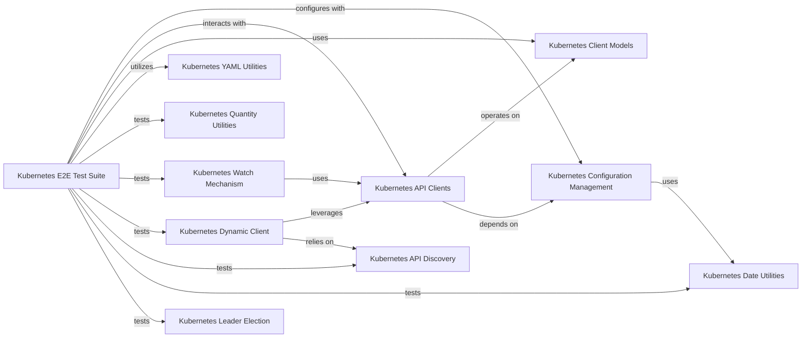

## Component Details

This overview details the `E2ETestSuite` subsystem within the Kubernetes Python client, which is crucial for validating the client's integration and behavior in a Kubernetes environment. The subsystem encompasses various end-to-end tests for API operations, dynamic client interactions, configuration loading, leader election, and streaming capabilities. It interacts with core Kubernetes client components like API clients, client models, and configuration management, and also utilizes specific utilities for YAML processing, quantity handling, and date parsing. The primary purpose is to ensure the robustness and correctness of the Kubernetes Python client across different functionalities and API groups.

### Kubernetes E2E Test Suite
This component comprises a collection of end-to-end tests designed to validate the functionality of various Kubernetes API interactions, including core resources, applications, batch jobs, and watch mechanisms. It also includes utility tests for YAML parsing and quantity handling.

**Related Classes/Methods**:

- <a href="https://github.com/kubernetes-client/python/blob/master/kubernetes/e2e_test/test_client.py#L67-L607" target="_blank" rel="noopener noreferrer">`kubernetes.e2e_test.test_client.TestClient` (67:607)</a>
- <a href="https://github.com/kubernetes-client/python/blob/master/kubernetes/e2e_test/test_client.py#L41-L43" target="_blank" rel="noopener noreferrer">`kubernetes.e2e_test.test_client.short_uuid` (41:43)</a>
- <a href="https://github.com/kubernetes-client/python/blob/master/kubernetes/e2e_test/test_client.py#L46-L64" target="_blank" rel="noopener noreferrer">`kubernetes.e2e_test.test_client.manifest_with_command` (46:64)</a>
- <a href="https://github.com/kubernetes-client/python/blob/master/kubernetes/e2e_test/test_utils.py#L27-L609" target="_blank" rel="noopener noreferrer">`kubernetes.e2e_test.test_utils.TestUtils` (27:609)</a>
- <a href="https://github.com/kubernetes-client/python/blob/master/kubernetes/e2e_test/test_utils.py#L612-L719" target="_blank" rel="noopener noreferrer">`kubernetes.e2e_test.test_utils.TestUtilsUnitTests` (612:719)</a>
- <a href="https://github.com/kubernetes-client/python/blob/master/kubernetes/e2e_test/test_watch.py#L44-L96" target="_blank" rel="noopener noreferrer">`kubernetes.e2e_test.test_watch.TestClient` (44:96)</a>
- <a href="https://github.com/kubernetes-client/python/blob/master/kubernetes/e2e_test/test_watch.py#L24-L26" target="_blank" rel="noopener noreferrer">`kubernetes.e2e_test.test_watch.short_uuid` (24:26)</a>
- <a href="https://github.com/kubernetes-client/python/blob/master/kubernetes/e2e_test/test_watch.py#L29-L41" target="_blank" rel="noopener noreferrer">`kubernetes.e2e_test.test_watch.config_map_with_value` (29:41)</a>
- <a href="https://github.com/kubernetes-client/python/blob/master/kubernetes/e2e_test/test_apps.py#L25-L112" target="_blank" rel="noopener noreferrer">`kubernetes.e2e_test.test_apps.TestClientApps` (25:112)</a>
- <a href="https://github.com/kubernetes-client/python/blob/master/kubernetes/e2e_test/test_batch.py#L23-L64" target="_blank" rel="noopener noreferrer">`kubernetes.e2e_test.test_batch.TestClientBatch` (23:64)</a>
- <a href="https://github.com/kubernetes-client/python/blob/master/kubernetes/base/config/kube_config_test.py#L402-L1625" target="_blank" rel="noopener noreferrer">`kubernetes.base.config.kube_config_test.TestKubeConfigLoader` (402:1625)</a>
- <a href="https://github.com/kubernetes-client/python/blob/master/kubernetes/base/leaderelection/leaderelection_test.py#L28-L205" target="_blank" rel="noopener noreferrer">`kubernetes.base.leaderelection.leaderelection_test.LeaderElectionTest` (28:205)</a>
- <a href="https://github.com/kubernetes-client/python/blob/master/kubernetes/e2e_test/base.py#L23-L46" target="_blank" rel="noopener noreferrer">`kubernetes.e2e_test.base.get_e2e_configuration` (23:46)</a>

### Kubernetes API Clients
This component provides the programmatic interfaces for interacting with different Kubernetes API groups, allowing for the creation, reading, updating, and deletion of various Kubernetes resources.

**Related Classes/Methods**:

- <a href="https://github.com/kubernetes-client/python/blob/master/kubernetes/client/api_client.py#L33-L647" target="_blank" rel="noopener noreferrer">`kubernetes.client.api_client.ApiClient` (33:647)</a>
- <a href="https://github.com/kubernetes-client/python/blob/master/kubernetes/client/api/core_v1_api.py#L27-L30454" target="_blank" rel="noopener noreferrer">`kubernetes.client.api.core_v1_api.CoreV1Api` (27:30454)</a>
- <a href="https://github.com/kubernetes-client/python/blob/master/kubernetes/client/api/apps_v1_api.py#L27-L9529" target="_blank" rel="noopener noreferrer">`kubernetes.client.api.apps_v1_api.AppsV1Api` (27:9529)</a>
- <a href="https://github.com/kubernetes-client/python/blob/master/kubernetes/client/api/batch_v1_api.py#L27-L3544" target="_blank" rel="noopener noreferrer">`kubernetes.client.api.batch_v1_api.BatchV1Api` (27:3544)</a>
- <a href="https://github.com/kubernetes-client/python/blob/master/kubernetes/client/api/rbac_authorization_v1_api.py#L27-L4736" target="_blank" rel="noopener noreferrer">`kubernetes.client.api.rbac_authorization_v1_api.RbacAuthorizationV1Api` (27:4736)</a>
- <a href="https://github.com/kubernetes-client/python/blob/master/kubernetes/client/api/apiregistration_v1_api.py#L27-L1593" target="_blank" rel="noopener noreferrer">`kubernetes.client.api.apiregistration_v1_api.ApiregistrationV1Api` (27:1593)</a>

### Kubernetes Client Models
This component defines the Python data structures that represent Kubernetes API objects, facilitating structured data exchange with the Kubernetes API server.

**Related Classes/Methods**:

- <a href="https://github.com/kubernetes-client/python/blob/master/kubernetes/client/models/v1_namespace.py#L21-L228" target="_blank" rel="noopener noreferrer">`kubernetes.client.models.v1_namespace.V1Namespace` (21:228)</a>
- <a href="https://github.com/kubernetes-client/python/blob/master/kubernetes/client/models/v1_object_meta.py#L21-L514" target="_blank" rel="noopener noreferrer">`kubernetes.client.models.v1_object_meta.V1ObjectMeta` (21:514)</a>
- <a href="https://github.com/kubernetes-client/python/blob/master/kubernetes/client/models/v1_delete_options.py#L21-L316" target="_blank" rel="noopener noreferrer">`kubernetes.client.models.v1_delete_options.V1DeleteOptions` (21:316)</a>

### Kubernetes Configuration Management
This component is responsible for loading, parsing, and managing the configuration settings required for the Kubernetes client to connect to and authenticate with a Kubernetes cluster, including handling different authentication methods and kubeconfig files.

**Related Classes/Methods**:

- <a href="https://github.com/kubernetes-client/python/blob/master/kubernetes/client/configuration.py#L25-L405" target="_blank" rel="noopener noreferrer">`kubernetes.client.configuration.Configuration` (25:405)</a>
- `kubernetes.config.kube_config.load_kube_config` (full file reference)
- <a href="https://github.com/kubernetes-client/python/blob/master/kubernetes/base/config/incluster_config_test.py#L46-L159" target="_blank" rel="noopener noreferrer">`kubernetes.base.config.incluster_config_test.InClusterConfigTest` (46:159)</a>
- <a href="https://github.com/kubernetes-client/python/blob/master/kubernetes/base/config/incluster_config_test.py#L54-L59" target="_blank" rel="noopener noreferrer">`kubernetes.base.config.incluster_config_test.InClusterConfigTest._create_file_with_temp_content` (54:59)</a>
- <a href="https://github.com/kubernetes-client/python/blob/master/kubernetes/base/config/incluster_config_test.py#L61-L72" target="_blank" rel="noopener noreferrer">`kubernetes.base.config.incluster_config_test.InClusterConfigTest.get_test_loader` (61:72)</a>
- <a href="https://github.com/kubernetes-client/python/blob/master/kubernetes/base/config/incluster_config_test.py#L111-L117" target="_blank" rel="noopener noreferrer">`kubernetes.base.config.incluster_config_test.InClusterConfigTest._should_fail_load` (111:117)</a>
- <a href="https://github.com/kubernetes-client/python/blob/master/kubernetes/base/config/kube_config_test.py#L165-L268" target="_blank" rel="noopener noreferrer">`kubernetes.base.config.kube_config_test.TestFileOrData` (165:268)</a>
- <a href="https://github.com/kubernetes-client/python/blob/master/kubernetes/base/config/kube_config_test.py#L168-L170" target="_blank" rel="noopener noreferrer">`kubernetes.base.config.kube_config_test.TestFileOrData.get_file_content` (168:170)</a>
- <a href="https://github.com/kubernetes-client/python/blob/master/kubernetes/base/config/kube_config_test.py#L159-L162" target="_blank" rel="noopener noreferrer">`kubernetes.base.config.kube_config_test.BaseTestCase.expect_exception` (159:162)</a>
- <a href="https://github.com/kubernetes-client/python/blob/master/kubernetes/base/config/kube_config_test.py#L152-L157" target="_blank" rel="noopener noreferrer">`kubernetes.base.config.kube_config_test.BaseTestCase._create_temp_file` (152:157)</a>
- <a href="https://github.com/kubernetes-client/python/blob/master/kubernetes/base/config/kube_config_test.py#L271-L344" target="_blank" rel="noopener noreferrer">`kubernetes.base.config.kube_config_test.TestConfigNode` (271:344)</a>
- <a href="https://github.com/kubernetes-client/python/blob/master/kubernetes/base/config/kube_config_test.py#L402-L1625" target="_blank" rel="noopener noreferrer">`kubernetes.base.config.kube_config_test.TestKubeConfigLoader` (402:1625)</a>
- <a href="https://github.com/kubernetes-client/python/blob/master/kubernetes/base/config/kube_config_test.py#L347-L399" target="_blank" rel="noopener noreferrer">`kubernetes.base.config.kube_config_test.FakeConfig` (347:399)</a>
- <a href="https://github.com/kubernetes-client/python/blob/master/kubernetes/base/config/kube_config_test.py#L73-L74" target="_blank" rel="noopener noreferrer">`kubernetes.base.config.kube_config_test._raise_exception` (73:74)</a>
- <a href="https://github.com/kubernetes-client/python/blob/master/kubernetes/base/config/kube_config_test.py#L66-L70" target="_blank" rel="noopener noreferrer">`kubernetes.base.config.kube_config_test._get_expiry` (66:70)</a>
- `kubernetes.base.config.kube_config_test.TestKubeConfigLoader.test_user_cmd_path.A` (full file reference)
- `kubernetes.base.config.kube_config_test.TestKubeConfigLoader.test_user_cmd_path_empty.A` (full file reference)
- `kubernetes.base.config.kube_config_test.TestKubeConfigLoader.test_user_cmd_path_with_scope.A` (full file reference)
- <a href="https://github.com/kubernetes-client/python/blob/master/kubernetes/base/config/kube_config_test.py#L1628-L1652" target="_blank" rel="noopener noreferrer">`kubernetes.base.config.kube_config_test.TestKubernetesClientConfiguration` (1628:1652)</a>
- <a href="https://github.com/kubernetes-client/python/blob/master/kubernetes/base/config/kube_config_test.py#L1655-L1911" target="_blank" rel="noopener noreferrer">`kubernetes.base.config.kube_config_test.TestKubeConfigMerger` (1655:1911)</a>
- <a href="https://github.com/kubernetes-client/python/blob/master/kubernetes/base/config/kube_config_test.py#L1846-L1850" target="_blank" rel="noopener noreferrer">`kubernetes.base.config.kube_config_test.TestKubeConfigMerger._create_multi_config` (1846:1850)</a>

### Kubernetes YAML Utilities
This component provides helper functions for creating Kubernetes resources directly from YAML definitions, either from files, directories, or Python dictionaries.

**Related Classes/Methods**:

- <a href="https://github.com/kubernetes-client/python/blob/master/kubernetes/utils/create_from_yaml.py#L99-L181" target="_blank" rel="noopener noreferrer">`kubernetes.utils.create_from_yaml.create_from_yaml` (99:181)</a>
- <a href="https://github.com/kubernetes-client/python/blob/master/kubernetes/utils/create_from_yaml.py#L184-L250" target="_blank" rel="noopener noreferrer">`kubernetes.utils.create_from_yaml.create_from_dict` (184:250)</a>
- <a href="https://github.com/kubernetes-client/python/blob/master/kubernetes/utils/create_from_yaml.py#L27-L96" target="_blank" rel="noopener noreferrer">`kubernetes.utils.create_from_yaml.create_from_directory` (27:96)</a>

### Kubernetes Quantity Utilities
This component offers utilities for parsing and formatting Kubernetes resource quantities, which are used to specify resource requests and limits for pods and containers.

**Related Classes/Methods**:

- <a href="https://github.com/kubernetes-client/python/blob/master/kubernetes/utils/quantity.py#L30-L85" target="_blank" rel="noopener noreferrer">`kubernetes.utils.quantity.parse_quantity` (30:85)</a>
- <a href="https://github.com/kubernetes-client/python/blob/master/kubernetes/utils/quantity.py#L88-L142" target="_blank" rel="noopener noreferrer">`kubernetes.utils.quantity.format_quantity` (88:142)</a>

### Kubernetes Watch Mechanism
This component enables applications to monitor changes to Kubernetes resources in real-time, receiving events for additions, modifications, and deletions.

**Related Classes/Methods**:

- `kubernetes.watch.watch.Watch` (full file reference)

### Kubernetes Dynamic Client
This component provides a flexible client that can interact with any Kubernetes API resource without requiring pre-generated client models, making it suitable for custom resources or dynamic API interactions.

**Related Classes/Methods**:

- <a href="https://github.com/kubernetes-client/python/blob/master/kubernetes/base/dynamic/test_client.py#L32-L537" target="_blank" rel="noopener noreferrer">`kubernetes.base.dynamic.test_client.TestDynamicClient` (32:537)</a>
- <a href="https://github.com/kubernetes-client/python/blob/master/kubernetes/base/dynamic/test_client.py#L540-L571" target="_blank" rel="noopener noreferrer">`kubernetes.base.dynamic.test_client.TestDynamicClientSerialization` (540:571)</a>
- <a href="https://github.com/kubernetes-client/python/blob/master/kubernetes/base/dynamic/test_client.py#L27-L29" target="_blank" rel="noopener noreferrer">`kubernetes.base.dynamic.test_client.short_uuid` (27:29)</a>

### Kubernetes API Discovery
This component is responsible for discovering the available API groups, versions, and resources supported by a Kubernetes cluster, which is crucial for the dynamic client to function correctly.

**Related Classes/Methods**:

- <a href="https://github.com/kubernetes-client/python/blob/master/kubernetes/base/dynamic/test_discovery.py#L24-L61" target="_blank" rel="noopener noreferrer">`kubernetes.base.dynamic.test_discovery.TestDiscoverer` (24:61)</a>

### Kubernetes Date Utilities
This component provides utility functions for parsing and handling date and time formats, specifically RFC3339, which is commonly used in Kubernetes API responses.

**Related Classes/Methods**:

- <a href="https://github.com/kubernetes-client/python/blob/master/kubernetes/base/config/dateutil_test.py#L21-L68" target="_blank" rel="noopener noreferrer">`kubernetes.base.config.dateutil_test.DateUtilTest` (21:68)</a>
- <a href="https://github.com/kubernetes-client/python/blob/master/kubernetes/base/config/dateutil_test.py#L23-L26" target="_blank" rel="noopener noreferrer">`kubernetes.base.config.dateutil_test.DateUtilTest._parse_rfc3339_test` (23:26)</a>

### Kubernetes Leader Election
This component implements the leader election protocol, allowing multiple instances of an application to coordinate and ensure that only one instance acts as the leader at any given time, crucial for high availability and distributed systems.

**Related Classes/Methods**:

- <a href="https://github.com/kubernetes-client/python/blob/master/kubernetes/base/leaderelection/leaderelection_test.py#L28-L205" target="_blank" rel="noopener noreferrer">`kubernetes.base.leaderelection.leaderelection_test.LeaderElectionTest` (28:205)</a>
- <a href="https://github.com/kubernetes-client/python/blob/master/kubernetes/base/leaderelection/leaderelection_test.py#L208-L266" target="_blank" rel="noopener noreferrer">`kubernetes.base.leaderelection.leaderelection_test.MockResourceLock` (208:266)</a>
- <a href="https://github.com/kubernetes-client/python/blob/master/kubernetes/base/leaderelection/leaderelection_test.py#L197-L205" target="_blank" rel="noopener noreferrer">`kubernetes.base.leaderelection.leaderelection_test.LeaderElectionTest.assert_history` (197:205)</a>

### [FAQ](https://github.com/CodeBoarding/GeneratedOnBoardings/tree/main?tab=readme-ov-file#faq)