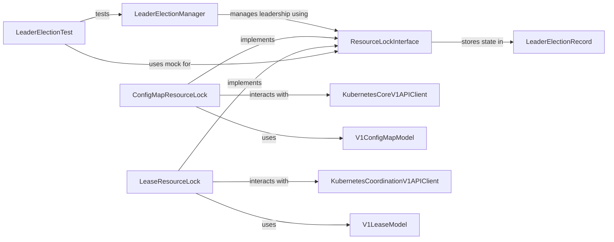

## Component Details

This component provides a robust implementation of leader election logic, crucial for building highly available and fault-tolerant applications in Kubernetes. It uses Kubernetes resources (like ConfigMaps or Leases) as distributed locks to ensure only one instance of an application performs a critical task at a time.

### LeaderElectionManager
Manages the leader election process, including acquiring and renewing the leadership lease. It orchestrates the election logic and interacts with a resource lock to maintain leadership.

**Related Classes/Methods**:

- <a href="https://github.com/kubernetes-client/python/blob/master/kubernetes/base/leaderelection/leaderelection.py#L40-L191" target="_blank" rel="noopener noreferrer">`kubernetes.base.leaderelection.leaderelection.LeaderElection` (40:191)</a>
- <a href="https://github.com/kubernetes-client/python/blob/master/kubernetes/base/leaderelection/leaderelection.py#L55-L67" target="_blank" rel="noopener noreferrer">`kubernetes.base.leaderelection.leaderelection.LeaderElection:run` (55:67)</a>
- <a href="https://github.com/kubernetes-client/python/blob/master/kubernetes/base/leaderelection/leaderelection.py#L69-L80" target="_blank" rel="noopener noreferrer">`kubernetes.base.leaderelection.leaderelection.LeaderElection:acquire` (69:80)</a>
- <a href="https://github.com/kubernetes-client/python/blob/master/kubernetes/base/leaderelection/leaderelection.py#L82-L105" target="_blank" rel="noopener noreferrer">`kubernetes.base.leaderelection.leaderelection.LeaderElection:renew_loop` (82:105)</a>
- <a href="https://github.com/kubernetes-client/python/blob/master/kubernetes/base/leaderelection/leaderelection.py#L107-L176" target="_blank" rel="noopener noreferrer">`kubernetes.base.leaderelection.leaderelection.LeaderElection:try_acquire_or_renew` (107:176)</a>
- <a href="https://github.com/kubernetes-client/python/blob/master/kubernetes/base/leaderelection/leaderelection.py#L178-L191" target="_blank" rel="noopener noreferrer">`kubernetes.base.leaderelection.leaderelection.LeaderElection:update_lock` (178:191)</a>

### ResourceLockInterface
Defines the abstract interface for resource lock mechanisms used in leader election. Concrete implementations provide methods to get, create, and update the leader election record.

**Related Classes/Methods**:

- `kubernetes.base.leaderelection.resourcelock.resourcelock.ResourceLock` (full file reference)

### ConfigMapResourceLock
Implements the resource lock mechanism using Kubernetes ConfigMaps. It provides methods to get, create, and update the leader election record stored in a ConfigMap, acting as the persistent storage for leadership status.

**Related Classes/Methods**:

- <a href="https://github.com/kubernetes-client/python/blob/master/kubernetes/base/leaderelection/resourcelock/configmaplock.py#L24-L129" target="_blank" rel="noopener noreferrer">`kubernetes.base.leaderelection.resourcelock.configmaplock.ConfigMapLock` (24:129)</a>
- <a href="https://github.com/kubernetes-client/python/blob/master/kubernetes/base/leaderelection/resourcelock/configmaplock.py#L25-L42" target="_blank" rel="noopener noreferrer">`kubernetes.base.leaderelection.resourcelock.configmaplock.ConfigMapLock:__init__` (25:42)</a>
- <a href="https://github.com/kubernetes-client/python/blob/master/kubernetes/base/leaderelection/resourcelock/configmaplock.py#L45-L72" target="_blank" rel="noopener noreferrer">`kubernetes.base.leaderelection.resourcelock.configmaplock.ConfigMapLock:get` (45:72)</a>
- <a href="https://github.com/kubernetes-client/python/blob/master/kubernetes/base/leaderelection/resourcelock/configmaplock.py#L74-L90" target="_blank" rel="noopener noreferrer">`kubernetes.base.leaderelection.resourcelock.configmaplock.ConfigMapLock:create` (74:90)</a>
- <a href="https://github.com/kubernetes-client/python/blob/master/kubernetes/base/leaderelection/resourcelock/configmaplock.py#L92-L107" target="_blank" rel="noopener noreferrer">`kubernetes.base.leaderelection.resourcelock.configmaplock.ConfigMapLock:update` (92:107)</a>
- <a href="https://github.com/kubernetes-client/python/blob/master/kubernetes/base/leaderelection/resourcelock/configmaplock.py#L109-L121" target="_blank" rel="noopener noreferrer">`kubernetes.base.leaderelection.resourcelock.configmaplock.ConfigMapLock:get_lock_object` (109:121)</a>
- <a href="https://github.com/kubernetes-client/python/blob/master/kubernetes/base/leaderelection/resourcelock/configmaplock.py#L123-L129" target="_blank" rel="noopener noreferrer">`kubernetes.base.leaderelection.resourcelock.configmaplock.ConfigMapLock:get_lock_dict` (123:129)</a>

### LeaseResourceLock
Implements the resource lock mechanism using Kubernetes Leases. It provides methods to get, create, and update the leader election record stored in a Lease object.

**Related Classes/Methods**:

- `kubernetes.base.leaderelection.resourcelock.leaselock.LeaseLock` (full file reference)

### LeaderElectionRecord
Represents the data structure used to store the leader election state, including holder identity, lease duration, and acquire/renew times.

**Related Classes/Methods**:

- <a href="https://github.com/kubernetes-client/python/blob/master/kubernetes/base/leaderelection/leaderelectionrecord.py#L16-L22" target="_blank" rel="noopener noreferrer">`kubernetes.base.leaderelection.leaderelectionrecord.LeaderElectionRecord` (16:22)</a>

### KubernetesCoreV1APIClient
Provides an interface to interact with the Kubernetes Core V1 API server, specifically for managing ConfigMap objects.

**Related Classes/Methods**:

- <a href="https://github.com/kubernetes-client/python/blob/master/kubernetes/client/api/core_v1_api.py#L27-L30454" target="_blank" rel="noopener noreferrer">`kubernetes.client.api.core_v1_api.CoreV1Api` (27:30454)</a>
- <a href="https://github.com/kubernetes-client/python/blob/master/kubernetes/client/api/core_v1_api.py#L23206-L23231" target="_blank" rel="noopener noreferrer">`kubernetes.client.api.core_v1_api.CoreV1Api.read_namespaced_config_map` (23206:23231)</a>
- <a href="https://github.com/kubernetes-client/python/blob/master/kubernetes/client/api/core_v1_api.py#L6613-L6641" target="_blank" rel="noopener noreferrer">`kubernetes.client.api.core_v1_api.CoreV1Api.create_namespaced_config_map` (6613:6641)</a>
- <a href="https://github.com/kubernetes-client/python/blob/master/kubernetes/client/api/core_v1_api.py#L26844-L26873" target="_blank" rel="noopener noreferrer">`kubernetes.client.api.core_v1_api.CoreV1Api.replace_namespaced_config_map` (26844:26873)</a>

### V1ConfigMapModel
Represents the Kubernetes V1ConfigMap object model, used for data serialization and deserialization when interacting with the Kubernetes API.

**Related Classes/Methods**:

- <a href="https://github.com/kubernetes-client/python/blob/master/kubernetes/client/models/v1_config_map.py#L21-L260" target="_blank" rel="noopener noreferrer">`kubernetes.client.models.v1_config_map.V1ConfigMap` (21:260)</a>

### KubernetesCoordinationV1APIClient
Provides an interface to interact with the Kubernetes Coordination V1 API server, specifically for managing Lease objects.

**Related Classes/Methods**:

- <a href="https://github.com/kubernetes-client/python/blob/master/kubernetes/client/api/coordination_v1_api.py#L27-L1402" target="_blank" rel="noopener noreferrer">`kubernetes.client.api.coordination_v1_api.CoordinationV1Api` (27:1402)</a>

### V1LeaseModel
Represents the Kubernetes V1Lease object model, used for data serialization and deserialization when interacting with the Kubernetes API.

**Related Classes/Methods**:

- <a href="https://github.com/kubernetes-client/python/blob/master/kubernetes/client/models/v1_lease.py#L21-L202" target="_blank" rel="noopener noreferrer">`kubernetes.client.models.v1_lease.V1Lease` (21:202)</a>

### LeaderElectionTest
Contains unit tests for the leader election mechanism, simulating different scenarios of leader election and verifying the behavior of the LeaderElection and ResourceLock components.

**Related Classes/Methods**:

- <a href="https://github.com/kubernetes-client/python/blob/master/kubernetes/base/leaderelection/leaderelection_test.py#L28-L205" target="_blank" rel="noopener noreferrer">`kubernetes.base.leaderelection.leaderelection_test.LeaderElectionTest` (28:205)</a>
- <a href="https://github.com/kubernetes-client/python/blob/master/kubernetes/base/leaderelection/leaderelection_test.py#L29-L60" target="_blank" rel="noopener noreferrer">`kubernetes.base.leaderelection.leaderelection_test.LeaderElectionTest:test_simple_leader_election` (29:60)</a>
- <a href="https://github.com/kubernetes-client/python/blob/master/kubernetes/base/leaderelection/leaderelection_test.py#L62-L137" target="_blank" rel="noopener noreferrer">`kubernetes.base.leaderelection.leaderelection_test.LeaderElectionTest:test_leader_election` (62:137)</a>
- <a href="https://github.com/kubernetes-client/python/blob/master/kubernetes/base/leaderelection/leaderelection_test.py#L152-L195" target="_blank" rel="noopener noreferrer">`kubernetes.base.leaderelection.leaderelection_test.LeaderElectionTest:test_Leader_election_with_renew_deadline` (152:195)</a>
- <a href="https://github.com/kubernetes-client/python/blob/master/kubernetes/base/leaderelection/leaderelection_test.py#L208-L266" target="_blank" rel="noopener noreferrer">`kubernetes.base.leaderelection.leaderelection_test.MockResourceLock` (208:266)</a>
- <a href="https://github.com/kubernetes-client/python/blob/master/kubernetes/base/leaderelection/leaderelection_test.py#L197-L205" target="_blank" rel="noopener noreferrer">`kubernetes.base.leaderelection.leaderelection_test.LeaderElectionTest.assert_history` (197:205)</a>

### [FAQ](https://github.com/CodeBoarding/GeneratedOnBoardings/tree/main?tab=readme-ov-file#faq)