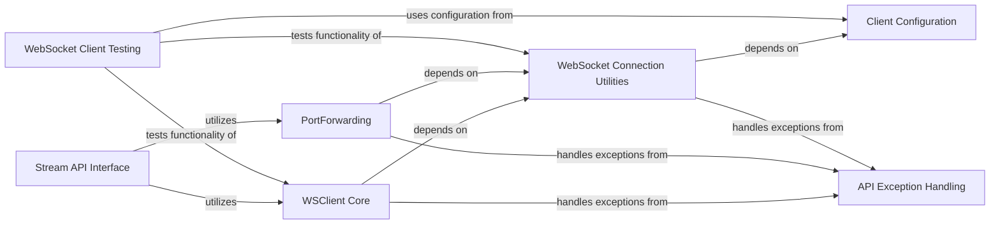

## Component Details

The StreamHandler subsystem is responsible for establishing and managing real-time WebSocket connections to the Kubernetes API server. Its primary purpose is to facilitate interactive communication with running pods, enabling functionalities such as streaming container logs and handling port-forwarding traffic. The main flow involves setting up WebSocket connections, managing data channels for different streams (like stdin, stdout, stderr), and orchestrating higher-level API interactions for streaming and port-forwarding operations. It also incorporates robust error handling and leverages client configuration for secure and efficient communication.

### WSClient Core
This component encapsulates the core functionality for managing WebSocket connections. It provides methods for reading from and writing to different channels (stdout, stderr, stdin), peeking at channel data, updating the connection status, and running the WebSocket communication loop. It also handles the return code of the WebSocket process.

**Related Classes/Methods**:

- <a href="https://github.com/kubernetes-client/python/blob/master/kubernetes/base/stream/ws_client.py#L51-L254" target="_blank" rel="noopener noreferrer">`kubernetes.base.stream.ws_client.WSClient` (51:254)</a>
- <a href="https://github.com/kubernetes-client/python/blob/master/kubernetes/base/stream/ws_client.py#L52-L70" target="_blank" rel="noopener noreferrer">`kubernetes.base.stream.ws_client.WSClient:__init__` (52:70)</a>
- <a href="https://github.com/kubernetes-client/python/blob/master/kubernetes/base/stream/ws_client.py#L72-L78" target="_blank" rel="noopener noreferrer">`kubernetes.base.stream.ws_client.WSClient:peek_channel` (72:78)</a>
- <a href="https://github.com/kubernetes-client/python/blob/master/kubernetes/base/stream/ws_client.py#L80-L88" target="_blank" rel="noopener noreferrer">`kubernetes.base.stream.ws_client.WSClient:read_channel` (80:88)</a>
- <a href="https://github.com/kubernetes-client/python/blob/master/kubernetes/base/stream/ws_client.py#L90-L107" target="_blank" rel="noopener noreferrer">`kubernetes.base.stream.ws_client.WSClient:readline_channel` (90:107)</a>
- <a href="https://github.com/kubernetes-client/python/blob/master/kubernetes/base/stream/ws_client.py#L122-L124" target="_blank" rel="noopener noreferrer">`kubernetes.base.stream.ws_client.WSClient:peek_stdout` (122:124)</a>
- <a href="https://github.com/kubernetes-client/python/blob/master/kubernetes/base/stream/ws_client.py#L126-L128" target="_blank" rel="noopener noreferrer">`kubernetes.base.stream.ws_client.WSClient:read_stdout` (126:128)</a>
- <a href="https://github.com/kubernetes-client/python/blob/master/kubernetes/base/stream/ws_client.py#L130-L132" target="_blank" rel="noopener noreferrer">`kubernetes.base.stream.ws_client.WSClient:readline_stdout` (130:132)</a>
- <a href="https://github.com/kubernetes-client/python/blob/master/kubernetes/base/stream/ws_client.py#L134-L136" target="_blank" rel="noopener noreferrer">`kubernetes.base.stream.ws_client.WSClient:peek_stderr` (134:136)</a>
- <a href="https://github.com/kubernetes-client/python/blob/master/kubernetes/base/stream/ws_client.py#L138-L140" target="_blank" rel="noopener noreferrer">`kubernetes.base.stream.ws_client.WSClient:read_stderr` (138:140)</a>
- <a href="https://github.com/kubernetes-client/python/blob/master/kubernetes/base/stream/ws_client.py#L142-L144" target="_blank" rel="noopener noreferrer">`kubernetes.base.stream.ws_client.WSClient:readline_stderr` (142:144)</a>
- <a href="https://github.com/kubernetes-client/python/blob/master/kubernetes/base/stream/ws_client.py#L164-L166" target="_blank" rel="noopener noreferrer">`kubernetes.base.stream.ws_client.WSClient:write_stdin` (164:166)</a>
- <a href="https://github.com/kubernetes-client/python/blob/master/kubernetes/base/stream/ws_client.py#L168-L218" target="_blank" rel="noopener noreferrer">`kubernetes.base.stream.ws_client.WSClient:update` (168:218)</a>
- <a href="https://github.com/kubernetes-client/python/blob/master/kubernetes/base/stream/ws_client.py#L220-L229" target="_blank" rel="noopener noreferrer">`kubernetes.base.stream.ws_client.WSClient:run_forever` (220:229)</a>
- <a href="https://github.com/kubernetes-client/python/blob/master/kubernetes/base/stream/ws_client.py#L231-L246" target="_blank" rel="noopener noreferrer">`kubernetes.base.stream.ws_client.WSClient:returncode` (231:246)</a>
- <a href="https://github.com/kubernetes-client/python/blob/master/kubernetes/base/stream/ws_client.py#L43-L48" target="_blank" rel="noopener noreferrer">`kubernetes.base.stream.ws_client._IgnoredIO` (43:48)</a>

### PortForwarding
This component provides functionality for establishing and managing port forwarding connections over WebSockets. It initializes port forwarding instances and handles the underlying port management.

**Related Classes/Methods**:

- <a href="https://github.com/kubernetes-client/python/blob/master/kubernetes/base/stream/ws_client.py#L260-L437" target="_blank" rel="noopener noreferrer">`kubernetes.base.stream.ws_client.PortForward` (260:437)</a>
- <a href="https://github.com/kubernetes-client/python/blob/master/kubernetes/base/stream/ws_client.py#L261-L281" target="_blank" rel="noopener noreferrer">`kubernetes.base.stream.ws_client.PortForward:__init__` (261:281)</a>
- `kubernetes.base.stream.ws_client._Port` (full file reference)

### WebSocket Connection Utilities
This component provides utility functions for creating and managing WebSocket connections, including handling proxy configurations, resolving WebSocket URLs, and orchestrating the overall WebSocket communication flow. It also defines the structure for WebSocket responses.

**Related Classes/Methods**:

- <a href="https://github.com/kubernetes-client/python/blob/master/kubernetes/base/stream/ws_client.py#L460-L500" target="_blank" rel="noopener noreferrer">`kubernetes.base.stream.ws_client.create_websocket` (460:500)</a>
- <a href="https://github.com/kubernetes-client/python/blob/master/kubernetes/base/stream/ws_client.py#L502-L518" target="_blank" rel="noopener noreferrer">`kubernetes.base.stream.ws_client.websocket_proxycare` (502:518)</a>
- <a href="https://github.com/kubernetes-client/python/blob/master/kubernetes/base/stream/ws_client.py#L521-L543" target="_blank" rel="noopener noreferrer">`kubernetes.base.stream.ws_client.websocket_call` (521:543)</a>
- <a href="https://github.com/kubernetes-client/python/blob/master/kubernetes/base/stream/ws_client.py#L440-L457" target="_blank" rel="noopener noreferrer">`kubernetes.base.stream.ws_client.get_websocket_url` (440:457)</a>
- `kubernetes.base.stream.ws_client.WSResponse` (full file reference)
- <a href="https://github.com/kubernetes-client/python/blob/master/kubernetes/base/stream/ws_client.py#L546-L576" target="_blank" rel="noopener noreferrer">`kubernetes.base.stream.ws_client.portforward_call` (546:576)</a>

### Stream API Interface
This component provides the high-level API interfaces for interacting with Kubernetes streams, including general streaming operations and specific port-forwarding functionalities. These modules orchestrate the use of the lower-level WebSocket client functionalities.

**Related Classes/Methods**:

- `kubernetes.stream.stream.stream` (full file reference)
- `kubernetes.stream.portforward.portforward` (full file reference)

### API Exception Handling
This component defines and handles exceptions that can occur during API interactions, specifically ApiException and ApiValueError, providing a structured way to manage errors in the Kubernetes client.

**Related Classes/Methods**:

- <a href="https://github.com/kubernetes-client/python/blob/master/kubernetes/client/exceptions.py#L84-L109" target="_blank" rel="noopener noreferrer">`kubernetes.client.exceptions.ApiException` (84:109)</a>
- <a href="https://github.com/kubernetes-client/python/blob/master/kubernetes/client/exceptions.py#L49-L64" target="_blank" rel="noopener noreferrer">`kubernetes.client.exceptions.ApiValueError` (49:64)</a>

### Client Configuration
This component manages the configuration settings for the Kubernetes API client, such as host, SSL verification, API keys, and proxy settings, which are crucial for establishing connections.

**Related Classes/Methods**:

- <a href="https://github.com/kubernetes-client/python/blob/master/kubernetes/client/configuration.py#L25-L405" target="_blank" rel="noopener noreferrer">`kubernetes.client.configuration.Configuration` (25:405)</a>

### WebSocket Client Testing
This component contains test cases for verifying the functionality of the WebSocket client, particularly focusing on proxy care and configuration aspects.

**Related Classes/Methods**:

- <a href="https://github.com/kubernetes-client/python/blob/master/kubernetes/base/stream/ws_client_test.py#L34-L73" target="_blank" rel="noopener noreferrer">`kubernetes.base.stream.ws_client_test.WSClientTest` (34:73)</a>
- <a href="https://github.com/kubernetes-client/python/blob/master/kubernetes/base/stream/ws_client_test.py#L49-L73" target="_blank" rel="noopener noreferrer">`kubernetes.base.stream.ws_client_test.WSClientTest:test_websocket_proxycare` (49:73)</a>
- <a href="https://github.com/kubernetes-client/python/blob/master/kubernetes/base/stream/ws_client_test.py#L27-L32" target="_blank" rel="noopener noreferrer">`kubernetes.base.stream.ws_client_test.dictval` (27:32)</a>

### [FAQ](https://github.com/CodeBoarding/GeneratedOnBoardings/tree/main?tab=readme-ov-file#faq)