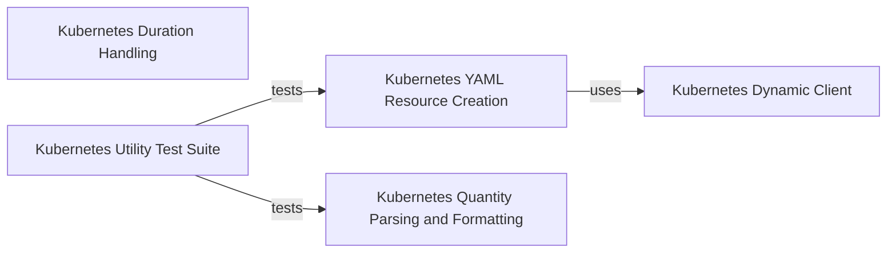

## Component Details

The Utilities component within the Kubernetes client library provides essential helper functions for common tasks. It encompasses functionalities for parsing and formatting Kubernetes resource quantities, handling time durations according to specific Kubernetes formats, and offering robust methods for creating Kubernetes objects from various input sources like YAML files, directories, or Python dictionaries. This component aims to simplify interactions with the Kubernetes API by abstracting complex data transformations and resource deployment mechanisms.

### Kubernetes YAML Resource Creation
This component provides high-level functions to create Kubernetes resources from YAML files or Python dictionaries, handling multiple documents and aggregating potential API exceptions during resource creation. It serves as a convenient interface for deploying resources.

**Related Classes/Methods**:

- <a href="https://github.com/kubernetes-client/python/blob/master/kubernetes/utils/create_from_yaml.py#L99-L181" target="_blank" rel="noopener noreferrer">`kubernetes.utils.create_from_yaml.create_from_yaml` (99:181)</a>
- <a href="https://github.com/kubernetes-client/python/blob/master/kubernetes/utils/create_from_yaml.py#L27-L96" target="_blank" rel="noopener noreferrer">`kubernetes.utils.create_from_yaml.create_from_directory` (27:96)</a>
- <a href="https://github.com/kubernetes-client/python/blob/master/kubernetes/utils/create_from_yaml.py#L184-L250" target="_blank" rel="noopener noreferrer">`kubernetes.utils.create_from_yaml.create_from_dict` (184:250)</a>
- <a href="https://github.com/kubernetes-client/python/blob/master/kubernetes/utils/create_from_yaml.py#L309-L324" target="_blank" rel="noopener noreferrer">`kubernetes.utils.create_from_yaml.FailToCreateError` (309:324)</a>
- <a href="https://github.com/kubernetes-client/python/blob/master/kubernetes/utils/create_from_yaml.py#L253-L306" target="_blank" rel="noopener noreferrer">`kubernetes.utils.create_from_yaml.create_from_yaml_single_item` (253:306)</a>

### Kubernetes Quantity Parsing and Formatting
This component offers utility functions for parsing and formatting Kubernetes resource quantities (e.g., '100m', '1Gi') into numerical equivalents and vice-versa, ensuring correct interpretation and representation of resource values.

**Related Classes/Methods**:

- `kubernetes.utils.quantity` (full file reference)
- <a href="https://github.com/kubernetes-client/python/blob/master/kubernetes/utils/quantity.py#L30-L85" target="_blank" rel="noopener noreferrer">`kubernetes.utils.quantity.parse_quantity` (30:85)</a>
- <a href="https://github.com/kubernetes-client/python/blob/master/kubernetes/utils/quantity.py#L88-L142" target="_blank" rel="noopener noreferrer">`kubernetes.utils.quantity.format_quantity` (88:142)</a>

### Kubernetes Duration Handling
This component provides utility functions for handling and converting time durations, which are essential for various time-based operations and configurations within the Kubernetes ecosystem.

**Related Classes/Methods**:

- `kubernetes.utils.duration` (full file reference)
- <a href="https://github.com/kubernetes-client/python/blob/master/kubernetes/utils/duration.py#L31-L80" target="_blank" rel="noopener noreferrer">`kubernetes.utils.duration.parse_duration` (31:80)</a>
- <a href="https://github.com/kubernetes-client/python/blob/master/kubernetes/utils/duration.py#L83-L174" target="_blank" rel="noopener noreferrer">`kubernetes.utils.duration.format_duration` (83:174)</a>

### Kubernetes Dynamic Client
This core client component enables dynamic interaction with the Kubernetes API server. It allows for the creation, retrieval, and management of Kubernetes resources based on their kind and API version, including support for advanced features like server-side apply.

**Related Classes/Methods**:

- <a href="https://github.com/kubernetes-client/python/blob/master/kubernetes/base/dynamic/client.py#L72-L327" target="_blank" rel="noopener noreferrer">`kubernetes.base.dynamic.client.DynamicClient` (72:327)</a>
- <a href="https://github.com/kubernetes-client/python/blob/master/kubernetes/base/dynamic/discovery.py#L198-L217" target="_blank" rel="noopener noreferrer">`kubernetes.base.dynamic.discovery.Discoverer.get` (198:217)</a>
- `kubernetes.client` (full file reference)

### Kubernetes Utility Test Suite
This component comprises a collection of end-to-end and unit tests specifically designed to validate the functionality of the Kubernetes utility modules, ensuring the correctness of resource creation from various configurations and the accuracy of quantity conversions.

**Related Classes/Methods**:

- <a href="https://github.com/kubernetes-client/python/blob/master/kubernetes/e2e_test/test_utils.py#L27-L609" target="_blank" rel="noopener noreferrer">`kubernetes.e2e_test.test_utils.TestUtils` (27:609)</a>
- <a href="https://github.com/kubernetes-client/python/blob/master/kubernetes/e2e_test/test_utils.py#L612-L719" target="_blank" rel="noopener noreferrer">`kubernetes.e2e_test.test_utils.TestUtilsUnitTests` (612:719)</a>

### [FAQ](https://github.com/CodeBoarding/GeneratedOnBoardings/tree/main?tab=readme-ov-file#faq)