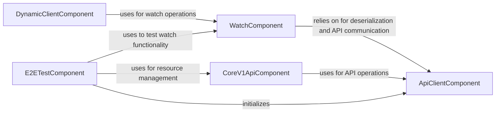

## Component Details

The Watcher subsystem in the Kubernetes client library is designed to provide real-time monitoring of Kubernetes resources. Its primary purpose is to enable applications to react to changes (creation, updates, deletions) in the cluster without continuous polling. The core flow involves a Watcher component establishing a stream with the Kubernetes API, which then receives event notifications. These raw event data are deserialized into usable Python objects by an API client, allowing applications to process and respond to the changes. End-to-end tests validate this real-time monitoring capability by simulating resource changes and verifying the received events.

### WatchComponent
The WatchComponent is responsible for establishing and maintaining a stream of events from the Kubernetes API. It handles the deserialization of incoming event data into Python objects, manages the lifecycle of the watch operation, and implements retry mechanisms for expired watch requests.

**Related Classes/Methods**:

- <a href="https://github.com/kubernetes-client/python/blob/master/kubernetes/base/watch/watch.py#L86-L223" target="_blank" rel="noopener noreferrer">`kubernetes.base.watch.watch.Watch` (86:223)</a>
- <a href="https://github.com/kubernetes-client/python/blob/master/kubernetes/base/watch/watch.py#L47-L51" target="_blank" rel="noopener noreferrer">`kubernetes.base.watch.watch._find_return_type` (47:51)</a>
- <a href="https://github.com/kubernetes-client/python/blob/master/kubernetes/base/watch/watch.py#L41-L44" target="_blank" rel="noopener noreferrer">`kubernetes.base.watch.watch.SimpleNamespace` (41:44)</a>
- <a href="https://github.com/kubernetes-client/python/blob/master/kubernetes/base/watch/watch.py#L54-L83" target="_blank" rel="noopener noreferrer">`kubernetes.base.watch.watch.iter_resp_lines` (54:83)</a>

### ApiClientComponent
The ApiClientComponent provides fundamental functionalities for interacting with the Kubernetes API. Its primary role in this subsystem is to deserialize raw API responses into structured Python objects, which is crucial for the WatchComponent to process event data, and to make HTTP requests.

**Related Classes/Methods**:

- <a href="https://github.com/kubernetes-client/python/blob/master/kubernetes/client/api_client.py#L33-L647" target="_blank" rel="noopener noreferrer">`kubernetes.client.api_client.ApiClient` (33:647)</a>

### CoreV1ApiComponent
The CoreV1ApiComponent offers a programmatic interface to the Kubernetes Core V1 API. It includes methods for managing core resources such as ConfigMaps, enabling operations like creation, listing, patching, and deletion, which are utilized in testing scenarios.

**Related Classes/Methods**:

- <a href="https://github.com/kubernetes-client/python/blob/master/kubernetes/client/api/core_v1_api.py#L27-L30454" target="_blank" rel="noopener noreferrer">`kubernetes.client.api.core_v1_api.CoreV1Api` (27:30454)</a>

### DynamicClientComponent
The DynamicClientComponent provides a flexible and dynamic way to interact with Kubernetes resources without requiring pre-generated client models. It can initiate watch operations on various resources by leveraging the WatchComponent.

**Related Classes/Methods**:

- <a href="https://github.com/kubernetes-client/python/blob/master/kubernetes/base/dynamic/client.py#L72-L327" target="_blank" rel="noopener noreferrer">`kubernetes.base.dynamic.client.DynamicClient` (72:327)</a>

### E2ETestComponent
The E2ETestComponent encompasses end-to-end tests specifically designed to validate the watch functionality within the Kubernetes client library. It demonstrates the practical application of the WatchComponent in conjunction with the CoreV1ApiComponent to monitor changes in Kubernetes resources like ConfigMaps.

**Related Classes/Methods**:

- <a href="https://github.com/kubernetes-client/python/blob/master/kubernetes/e2e_test/test_watch.py#L44-L96" target="_blank" rel="noopener noreferrer">`kubernetes.e2e_test.test_watch.TestClient` (44:96)</a>
- <a href="https://github.com/kubernetes-client/python/blob/master/kubernetes/e2e_test/test_watch.py#L24-L26" target="_blank" rel="noopener noreferrer">`kubernetes.e2e_test.test_watch.short_uuid` (24:26)</a>
- <a href="https://github.com/kubernetes-client/python/blob/master/kubernetes/e2e_test/test_watch.py#L29-L41" target="_blank" rel="noopener noreferrer">`kubernetes.e2e_test.test_watch.config_map_with_value` (29:41)</a>

### [FAQ](https://github.com/CodeBoarding/GeneratedOnBoardings/tree/main?tab=readme-ov-file#faq)