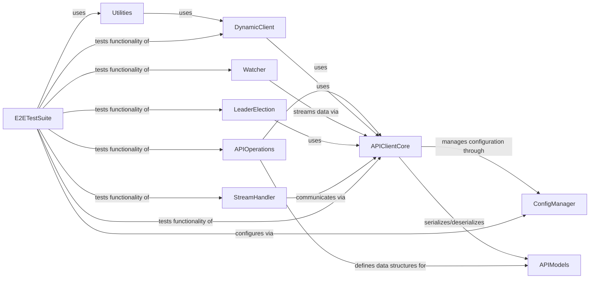

## Component Details

The Kubernetes Python client provides a comprehensive interface for interacting with Kubernetes clusters. Its architecture is centered around the APIClientCore for fundamental communication, supported by ConfigManager for connection setup and APIModels for data representation. APIOperations offers high-level, resource-specific interactions, while DynamicClient provides flexible runtime API discovery. Real-time cluster monitoring is handled by Watcher and StreamHandler, and distributed coordination is facilitated by LeaderElection. Utilities provide general helper functions, and the E2ETestSuite ensures the client's robust functionality.

### APIClientCore
The foundational component for interacting with the Kubernetes API. It manages HTTP requests, responses, and handles data serialization/deserialization. It also integrates with the ConfigManager for authentication and connection details.

**Related Classes/Methods**:

- <a href="https://github.com/kubernetes-client/python/blob/master/kubernetes/client/api_client.py#L33-L647" target="_blank" rel="noopener noreferrer">`kubernetes.client.api_client.ApiClient` (33:647)</a>
- <a href="https://github.com/kubernetes-client/python/blob/master/kubernetes/client/configuration.py#L25-L405" target="_blank" rel="noopener noreferrer">`kubernetes.client.configuration.Configuration` (25:405)</a>
- <a href="https://github.com/kubernetes-client/python/blob/master/kubernetes/client/rest.py#L51-L305" target="_blank" rel="noopener noreferrer">`kubernetes.client.rest.RESTClientObject` (51:305)</a>
- <a href="https://github.com/kubernetes-client/python/blob/master/kubernetes/client/exceptions.py#L49-L64" target="_blank" rel="noopener noreferrer">`kubernetes.client.exceptions.ApiValueError` (49:64)</a>

### APIOperations
This component consists of auto-generated API classes (e.g., CoreV1Api, AppsV1Api) that provide specific methods for CRUD operations on various Kubernetes resources. Each class is tailored to a particular API group and version.

**Related Classes/Methods**:

- <a href="https://github.com/kubernetes-client/python/blob/master/kubernetes/client/api/core_v1_api.py#L27-L30454" target="_blank" rel="noopener noreferrer">`kubernetes.client.api.core_v1_api.CoreV1Api` (27:30454)</a>
- <a href="https://github.com/kubernetes-client/python/blob/master/kubernetes/client/api/apps_v1_api.py#L27-L9529" target="_blank" rel="noopener noreferrer">`kubernetes.client.api.apps_v1_api.AppsV1Api` (27:9529)</a>
- <a href="https://github.com/kubernetes-client/python/blob/master/kubernetes/client/api/batch_v1_api.py#L27-L3544" target="_blank" rel="noopener noreferrer">`kubernetes.client.api.batch_v1_api.BatchV1Api` (27:3544)</a>

### APIModels
This component comprises Python classes that represent the various data structures and schemas for Kubernetes API objects (e.g., V1Pod, V1Service). These models are crucial for type-checking, validation, and structuring data exchanged with the Kubernetes API server.

**Related Classes/Methods**:

- <a href="https://github.com/kubernetes-client/python/blob/master/kubernetes/client/models/v1_pod.py#L21-L228" target="_blank" rel="noopener noreferrer">`kubernetes.client.models.v1_pod.V1Pod` (21:228)</a>
- <a href="https://github.com/kubernetes-client/python/blob/master/kubernetes/client/models/v1_service.py#L21-L228" target="_blank" rel="noopener noreferrer">`kubernetes.client.models.v1_service.V1Service` (21:228)</a>
- <a href="https://github.com/kubernetes-client/python/blob/master/kubernetes/client/models/v1_object_meta.py#L21-L514" target="_blank" rel="noopener noreferrer">`kubernetes.client.models.v1_object_meta.V1ObjectMeta` (21:514)</a>

### ConfigManager
This component is responsible for loading, parsing, and managing Kubernetes client configurations from various sources like kubeconfig files and in-cluster configurations. It sets up the client's connection parameters and authentication mechanisms.

**Related Classes/Methods**:

- <a href="https://github.com/kubernetes-client/python/blob/master/kubernetes/base/config/kube_config.py#L186-L598" target="_blank" rel="noopener noreferrer">`kubernetes.base.config.kube_config.KubeConfigLoader` (186:598)</a>
- <a href="https://github.com/kubernetes-client/python/blob/master/kubernetes/base/config/kube_config.py#L667-L754" target="_blank" rel="noopener noreferrer">`kubernetes.base.config.kube_config.KubeConfigMerger` (667:754)</a>
- <a href="https://github.com/kubernetes-client/python/blob/master/kubernetes/base/config/kube_config.py#L601-L664" target="_blank" rel="noopener noreferrer">`kubernetes.base.config.kube_config.ConfigNode` (601:664)</a>
- <a href="https://github.com/kubernetes-client/python/blob/master/kubernetes/base/config/kube_config.py#L86-L143" target="_blank" rel="noopener noreferrer">`kubernetes.base.config.kube_config.FileOrData` (86:143)</a>
- `kubernetes.base.config.incluster_config` (full file reference)
- <a href="https://github.com/kubernetes-client/python/blob/master/kubernetes/base/config/exec_provider.py#L22-L116" target="_blank" rel="noopener noreferrer">`kubernetes.base.config.exec_provider.ExecProvider` (22:116)</a>

### DynamicClient
Provides a flexible and generic interface for interacting with Kubernetes resources. It can discover API groups and resources at runtime, allowing interaction with custom resources and new API versions without requiring code regeneration.

**Related Classes/Methods**:

- <a href="https://github.com/kubernetes-client/python/blob/master/kubernetes/base/dynamic/client.py#L72-L327" target="_blank" rel="noopener noreferrer">`kubernetes.base.dynamic.client.DynamicClient` (72:327)</a>
- <a href="https://github.com/kubernetes-client/python/blob/master/kubernetes/base/dynamic/discovery.py#L319-L395" target="_blank" rel="noopener noreferrer">`kubernetes.base.dynamic.discovery.EagerDiscoverer` (319:395)</a>
- <a href="https://github.com/kubernetes-client/python/blob/master/kubernetes/base/dynamic/discovery.py#L220-L316" target="_blank" rel="noopener noreferrer">`kubernetes.base.dynamic.discovery.LazyDiscoverer` (220:316)</a>
- <a href="https://github.com/kubernetes-client/python/blob/master/kubernetes/base/dynamic/resource.py#L22-L105" target="_blank" rel="noopener noreferrer">`kubernetes.base.dynamic.resource.Resource` (22:105)</a>

### Watcher
The Watcher component is responsible for monitoring and streaming real-time changes to Kubernetes resources. It allows applications to react to events like creation, updates, or deletions of objects in the cluster without constantly polling the API.

**Related Classes/Methods**:

- <a href="https://github.com/kubernetes-client/python/blob/master/kubernetes/base/watch/watch.py#L86-L223" target="_blank" rel="noopener noreferrer">`kubernetes.base.watch.watch.Watch` (86:223)</a>

### StreamHandler
The Stream Handler component is responsible for managing WebSocket connections to the Kubernetes API server. It facilitates real-time streaming of data, such as container logs and port-forwarding traffic, enabling interactive communication with running pods.

**Related Classes/Methods**:

- <a href="https://github.com/kubernetes-client/python/blob/master/kubernetes/base/stream/ws_client.py#L51-L254" target="_blank" rel="noopener noreferrer">`kubernetes.base.stream.ws_client.WSClient` (51:254)</a>
- <a href="https://github.com/kubernetes-client/python/blob/master/kubernetes/base/stream/ws_client.py#L260-L437" target="_blank" rel="noopener noreferrer">`kubernetes.base.stream.ws_client.PortForward` (260:437)</a>
- `kubernetes.stream.stream.stream` (full file reference)
- `kubernetes.stream.portforward.portforward` (full file reference)

### LeaderElection
This component provides a robust implementation of leader election logic, crucial for building highly available and fault-tolerant applications in Kubernetes. It uses Kubernetes resources (like ConfigMaps or Leases) as distributed locks to ensure only one instance of an application performs a critical task at a time.

**Related Classes/Methods**:

- <a href="https://github.com/kubernetes-client/python/blob/master/kubernetes/base/leaderelection/leaderelection.py#L40-L191" target="_blank" rel="noopener noreferrer">`kubernetes.base.leaderelection.leaderelection.LeaderElection` (40:191)</a>
- <a href="https://github.com/kubernetes-client/python/blob/master/kubernetes/base/leaderelection/resourcelock/configmaplock.py#L24-L129" target="_blank" rel="noopener noreferrer">`kubernetes.base.leaderelection.resourcelock.configmaplock.ConfigMapLock` (24:129)</a>
- <a href="https://github.com/kubernetes-client/python/blob/master/kubernetes/base/leaderelection/leaderelectionrecord.py#L16-L22" target="_blank" rel="noopener noreferrer">`kubernetes.base.leaderelection.leaderelectionrecord.LeaderElectionRecord` (16:22)</a>

### Utilities
This component provides general utility functions that assist in common tasks within the Kubernetes client library, such as parsing and formatting resource quantities and creating Kubernetes objects from various input formats like YAML or dictionaries.

**Related Classes/Methods**:

- <a href="https://github.com/kubernetes-client/python/blob/master/kubernetes/utils/create_from_yaml.py#L99-L181" target="_blank" rel="noopener noreferrer">`kubernetes.utils.create_from_yaml.create_from_yaml` (99:181)</a>
- `kubernetes.utils.quantity` (full file reference)
- `kubernetes.utils.duration` (full file reference)

### E2ETestSuite
This component contains end-to-end testing functionalities for the Kubernetes Python client. It includes test cases for various API operations, utility functions, dynamic client interactions, configuration loading, leader election, and streaming capabilities, ensuring the client's proper integration and behavior within a Kubernetes environment.

**Related Classes/Methods**:

- <a href="https://github.com/kubernetes-client/python/blob/master/kubernetes/e2e_test/test_client.py#L67-L607" target="_blank" rel="noopener noreferrer">`kubernetes.e2e_test.test_client.TestClient` (67:607)</a>
- <a href="https://github.com/kubernetes-client/python/blob/master/kubernetes/e2e_test/test_utils.py#L27-L609" target="_blank" rel="noopener noreferrer">`kubernetes.e2e_test.test_utils.TestUtils` (27:609)</a>
- <a href="https://github.com/kubernetes-client/python/blob/master/kubernetes/base/config/kube_config_test.py#L402-L1625" target="_blank" rel="noopener noreferrer">`kubernetes.base.config.kube_config_test.TestKubeConfigLoader` (402:1625)</a>
- <a href="https://github.com/kubernetes-client/python/blob/master/kubernetes/base/leaderelection/leaderelection_test.py#L28-L205" target="_blank" rel="noopener noreferrer">`kubernetes.base.leaderelection.leaderelection_test.LeaderElectionTest` (28:205)</a>

### [FAQ](https://github.com/CodeBoarding/GeneratedOnBoardings/tree/main?tab=readme-ov-file#faq)